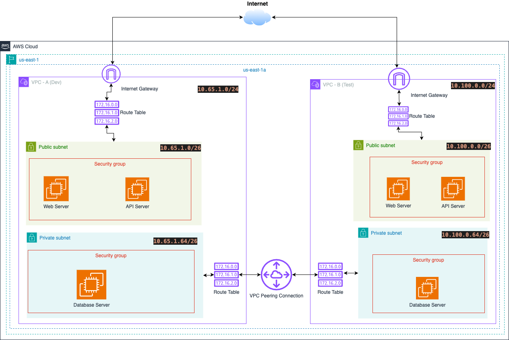

# Network Fundamentals BootCamp 2025-Q2

## Three-Tier Web App with VPC Peering
### Objectives
1. Design & deploy two isolated VPCs (e.g., “Prod” and “Dev”)

2. Implement a classic three-tier architecture (Web → App → DB) in each VPC

3. Connect the two VPCs via VPC Peering, showing cross-VPC communication

4. Demonstrate routing, Internet/NAT gateways, and security controls

5. Validate connectivity & security boundaries

[Draw.io Link](https://drive.google.com/file/d/1Vcesp1mjpNYdCH9gp-mcBoD6BlHwcibg/view?usp=sharing)

## Technical Demonstration

This repository presents a hands-on journey through Network Fundamentals in the two Weeks of the bootcamp. Below are the key technical highlights from each lesson – designed to demonstrate real-world skills in IP addressing, subnet design, firewall configuration, and cloud networking automation.

### Week 1

#### Lesson 1: Fundamentals of Networking
- Mastered binary-to-decimal conversion and IPv4 addressing schemes.  
- Explored the OSI model layers and mapped common protocols (Ethernet, IP, TCP/UDP).  
- Performed manual host configuration and verified link-level connectivity.

#### Lesson 2: Subnetting & Topology Planning
- Applied subnet masks to carve supernets into subnets for efficient IP allocation.  
- Designed multi-subnet topologies supporting isolation and hierarchy.  
- Simulated network links and routing behavior in Packet Tracer.

#### Lesson 3: Linux IP Address Management
- Configured IPv4/IPv6 addresses via `ip addr` and Netplan.  
- Automated network configuration with YAML and validated routes.  
- Integrated DNS resolution with `systemd-resolved` overrides.

#### Lesson 4: Packet Tracer Simulation
- Built a multi-switch, multi-router topology in Cisco Packet Tracer.  
- Applied IOS commands (`ip address`, `no shut`, `show ip int br`) to configure interfaces.  
- Captured and analyzed packet flows across routing and switching domains.

#### Lesson 5: Windows Networking Tools
- Leveraged `ipconfig`, `ping`, `tracert`, `nslookup`, and `netstat` for diagnosis.  
- Parsed AWS EC2 `ipconfig /all` output to map cloud network metadata.  
- Scripted common lookup tasks in PowerShell.

#### Lesson 6: Windows Firewall Rules
- Defined inbound/outbound rules using Windows Defender Firewall cmdlets.  
- Tested rule effects with `telnet` and `Test-NetConnection`.  
- Automated blocking of specific ports and protocols across profiles.

#### Lesson 7: Linux Networking Utilities
- Used `dig`, `netstat`, `curl`, `lsof`, `tcpdump`, and `wget` for deep-dive analysis.  
- Compared `curl` vs `wget` for scripting downloads and health checks.  
- Captured live traffic with `tcpdump` filters and analyzed `.pcap` files.

#### Lesson 8: Linux Firewall Rules
- Crafted outbound rules via UFW, firewalld rich rules, and raw iptables.  
- Explored DROP vs REJECT semantics and rule counters.  
- Ensured persistence across Debian/Ubuntu and RHEL variants.

#### Lesson 9: Cloud Networking in AWS
- Automated VPC design with public/private subnets, IGWs, and route tables via CloudFormation.  
- Parameterized templates for CIDRs, regions, and security groups.  
- Deployed change sets safely with `aws cloudformation deploy --no-execute-changeset` and reviewed in console.

## Journals
### Week 1
- [x] [Lesson 1](./journals/week-1/lesson-1.md)
- [x] [Lesson 2](./journals/week-1/lesson-2.md)
- [x] [Lesson 3](./journals/week-1/lesson-3.md)
- [x] [Lesson 4](./journals/week-1/lesson-4.md)
- [x] [Lesson 5](./journals/week-1/lesson-5.md)
- [x] [Lesson 6](./journals/week-1/lesson-6.md)
- [x] [Lesson 7](./journals/week-1/lesson-7.md)
- [x] [Lesson 8](./journals/week-1/lesson-8.md)
- [x] [Lesson 9](./journals/week-1/lesson-9.md)

## More Learning Resources
- [Basic Networking COMPTIA - Youtube](https://www.youtube.com/watch?v=Xl0r_P07l2I)

