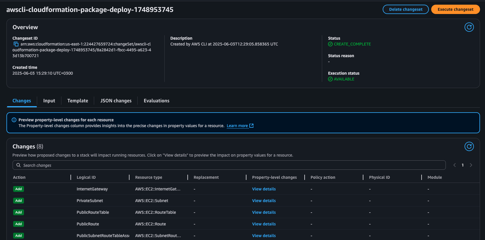

# Cloud Environment Setup With AWS CloudFormation

## Install and Configure the AWS CLI 

To install the AWS CLI follow the link [here](https://docs.aws.amazon.com/cli/latest/userguide/getting-started-install.html)

To configure the AWS CLI follow the instructions see [Configuring settings for the AWS CLI](https://docs.aws.amazon.com/cli/latest/userguide/cli-chap-configure.html) and [Configuration and credential file settings in the AWS CLI](https://docs.aws.amazon.com/cli/latest/userguide/cli-configure-files.html)

```sh
export PROFILE=your-profile-name
aws configure --profile $PROFILE
```

Confirm profile configuration setting

```sh
aws sts get-caller-identity --profile $PROFILE
```

Output

```json
{
    "UserId": "AIDATIQHOKHGBI2FG4GYG",
    "Account": "224427659724",
    "Arn": "arn:aws:iam::224427659724:user/pwalukagga"
}
```

```sh
aws configure list --profile $PROFILE
```

```                                                    
      Name                    Value             Type    Location
      ----                    -----             ----    --------
   profile                your-profile-name           manual    --profile
access_key     ****************OH4C shared-credentials-file
secret_key     ****************Jmnm shared-credentials-file
    region                us-east-1      config-file    ~/.aws/config
```

## Install the AWS CFN CLI
To install the CFN-CLI run the command below

```sh
pip install cloudformation-cli cloudformation-cli-java-plugin cloudformation-cli-go-plugin cloudformation-cli-python-plugin cloudformation-cli-typescript-plugin
```

For a specific OS follow the instructions [here](https://docs.aws.amazon.com/cloudformation-cli/latest/userguide/what-is-cloudformation-cli.html)

### CFN-Toml
Toml Configuration for Bash scripts using CloudFormation library created by [Andrew Brown](https://github.com/omenking) written in Ruby. This will allow us to pull in external parameters as variables within our deploy scripts, then pass them during creation from our CFN templates. These values are normally hardcoded into the script/command to deploy the CFN template, but with Andrew's library this won't be necessary.

Go to Andrew's public repo for cfn-toml here: https://github.com/teacherseat/cfn-toml/tree/main and we walk through how to use it. We begin by installing cfn-toml through the CLI:

```sh
gem install cfn-toml
```

Extracting environment variables and parsing parameter configurations using [TOML](https://www.w3schools.io/file/toml-introduction/) for cloudformation templates.

### CFN-Lint

We can also use cfn-lint. See how to setup cfn-lint [here - cfn-lint](https://github.com/aws-cloudformation/cfn-lint)

#### Install

**Pip**

```sh
pip install cfn-lint. 
```

If pip is not available, run `python setup.py clean --all` then `python setup.py install`.

**Homebrew (macOS)**

```sh
brew install cfn-lint
```

## How to Deploy AWS VPC Network

### VPC AWS Infrastructure Composer


### Check your AWS Account

```sh
aws sts get-caller-identity --profile $PROFILE
```

### Run Deployment Script

```sh
cd projects/cloud-env-setup-iac
chmod u+x ./bin/network/aws/vpc/*
./bin/network/aws/vpc/deploy -p $PROFILE
```


Go to AWS Cloudformation in the web console to review and execute changeset




View Stack Events and confirm that is complete


#### Resources, Outputs, and Parameters

**Resources**


**Parameters**


**Outputs**


**Deployed VPC**


## Provision Windows EC2 Instance with AWS CFN

### Windows EC2 AWS Infrastructure Composer


### Check your AWS Account

```sh
aws sts get-caller-identity --profile $PROFILE
```

### Run Deployment Script

```sh
cd projects/cloud-env-setup-iac
chmod u+x ./bin/ec2/windows/**
./bin/ec2/windows/deploy -p $PROFILE -p $PROFILE
```


Go to AWS Cloudformation in the web console to review and execute changeset


View Stack Events and confirm that is complete


#### Resources, and Outputs
**Resources**


**Outputs**


**Deployed VPC**


**Windows RDP Client**


## Provision Ubuntu EC2 Instance with AWS CFN

### Ubuntu EC2 AWS Infrastructure Composer


### Check your AWS Account

```sh
aws sts get-caller-identity --profile $PROFILE
```

### Run Deployment Script

```sh
cd projects/cloud-env-setup-iac
chmod u+x ./bin/ec2/ubuntu/**
./bin/ec2/ubuntu/deploy -p $PROFILE -p $PROFILE
```


Go to AWS Cloudformation in the web console to review and execute changeset


View Stack Events and confirm that is complete


#### Resources, and Outputs
**Resources**


**Outputs**


**Deployed VPC**


### Connect to Ubuntu Instance via SSH (PuTTY / Native SSH)

Follow these steps to access your Ubuntu instance using PuTTY (Windows/macOS) or the native SSH client on Linux/macOS:

1. **Install PuTTY and PuTTYgen**  
   - Windows: Download from [putty.org](https://www.putty.org/)  
   - macOS: Follow instructions at [SSH.com PuTTY on Mac](https://www.ssh.com/academy/ssh/putty/mac)  

2. **Generate / Load SSH Key in PuTTY and PuTTYgen (Windows)**  
   - Open **PuTTYgen** and click **Load**  
   - Select your private key file `nwtbootcampkey.pem`  
   - Click **Save private key** to export as `.ppk`  

3. **Connect with PuTTY and puttygen (Windows)**  
   - Open **PuTTY**  
   - _Host Name_: `ubuntu@<public-ip>`  
   - Under **Connection → SSH → Auth**, browse to your `.ppk` file  
   - Click **Open** to start the SSH session  

4. **Connect Using Native SSH (macOS)**  
```bash
# Convert PuTTY PPK to OpenSSH PEM format
puttygen "../key-pairs/nwtbootcampkey-ppk.ppk" -O private-openssh -o "../key-pairs/nwtbootcampkey-ppk.pem"

# Restrict private key permissions
chmod go-rw ../key-pairs/nwtbootcampkey-ppk.pem

# SSH into Ubuntu instance (replace with your public DNS)
ssh -i "../key-pairs/nwtbootcampkey.pem" ubuntu@ec2-13-220-241-36.compute-1.amazonaws.com
```


## Clean Resources

To clean all the provisioned resources run the commands

```sh
./bin/ec2/ubuntu/delete -p $PROFILE
./bin/ec2/windows/delete -p $PROFILE
./bin/network/aws/vpc/delete -p $PROFILE
```

