# Cloud Networking

## AWS VPC Peering

AWS VPC Peering is a private, point-to-point network connection between two Amazon VPCs that lets resources in each VPC communicate as if they’re within the same network. Key points:

**Peer-to-Peer Only**

- Non-transitive—traffic only flows between the two peered VPCs, so you must explicitly peer every VPC pair.
- No overlapping CIDR ranges allowed.

**Cross-Account & Cross-Region**

- You can peer VPCs in the same AWS account or across accounts.
- You can also establish peering across regions (inter-region VPC Peering).

**Route Tables & DNS**

- After creating and accepting the peering connection, each VPC’s route tables must be updated to point to the peer’s CIDR via the peering connection.
- Optionally enable “DNS resolution from peer” so that private hostnames in one VPC resolve to private IPs in the other.

**Use Cases**

- Share centrally-managed services (e.g., authentication, logging) across environments.
- Isolate workloads into separate VPCs (dev/test/prod) while still allowing controlled communication.
- Connect accounts or regions without exposing traffic to the public internet.

**Limits & Costs**

- There’s no per-hour charge for the peering connection itself, but standard inter-AZ and inter-region data transfer rates apply.
- Maximum of 125 peering connections per VPC by default (soft quota).

In practice you:

- Create a VPC Peering Connection resource (or via console/CLI).
- Accept the peering request in the target VPC.
- Add routes in each VPC’s route tables for the peer CIDR block pointing to the peering connection.
- (Optional) Enable DNS resolution over the peer so that private DNS names are visible peer-to-peer.

### Creating a VPC Peering connection between two VPCs in the same AWS Account

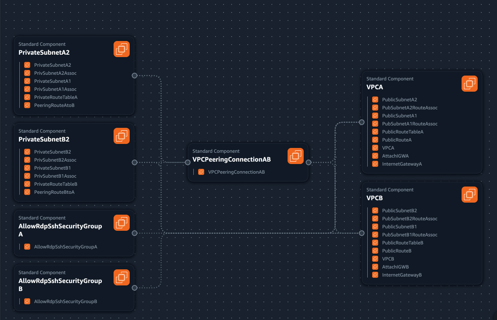


### Check your AWS Account

```sh
aws sts get-caller-identity --profile $PROFILE
```

### Run Deployment Script

```sh
cd projects/cloud-networking
chmod u+x ./bin/aws/*
./bin/aws/network-deploy -p $PROFILE
```

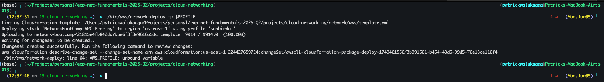

Go to AWS Cloudformation in the web console to review and execute changeset

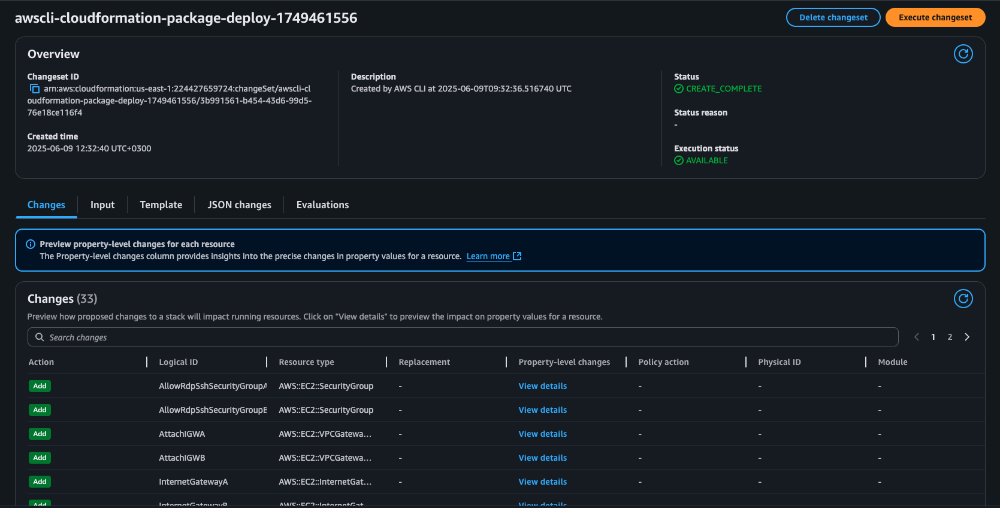
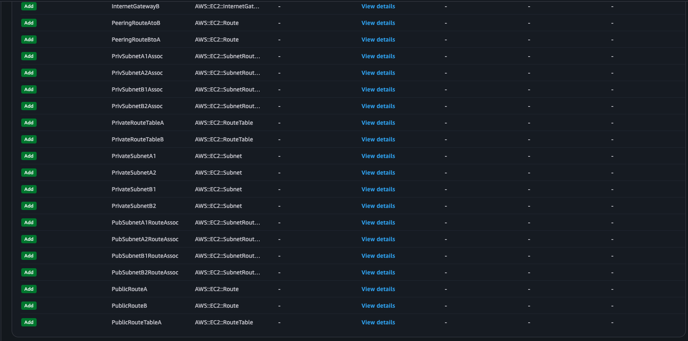

View Stack Events and confirm that is complete

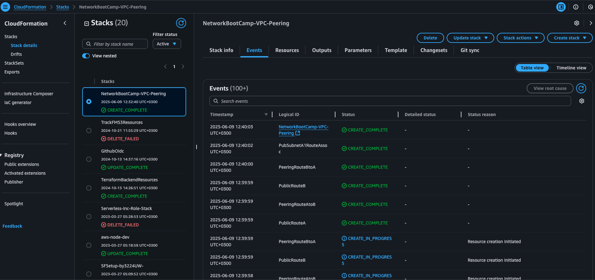

#### Resources, Outputs, and Parameters

**Resources**

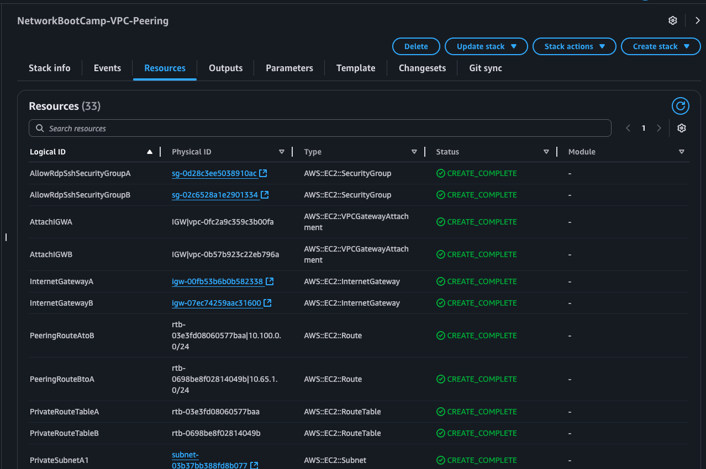

**Parameters**

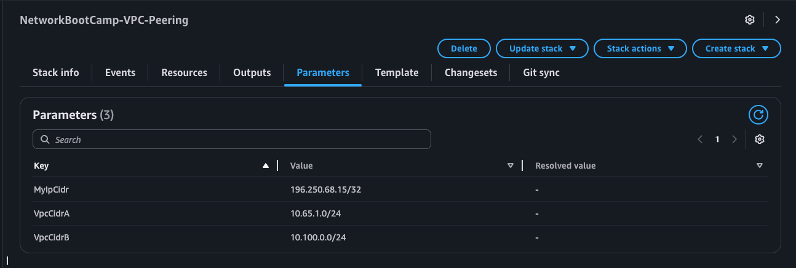

**Outputs**

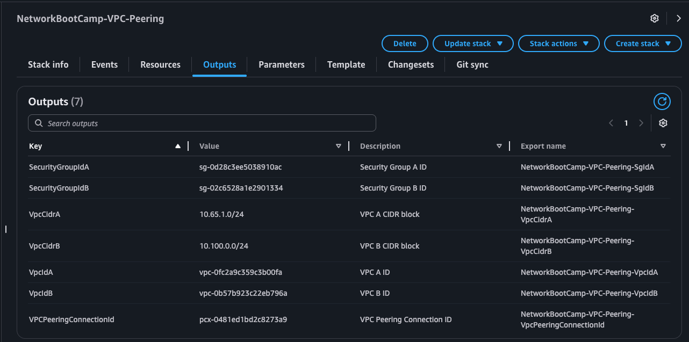

**Deployed VPCs**

**VPC A (Requester)**
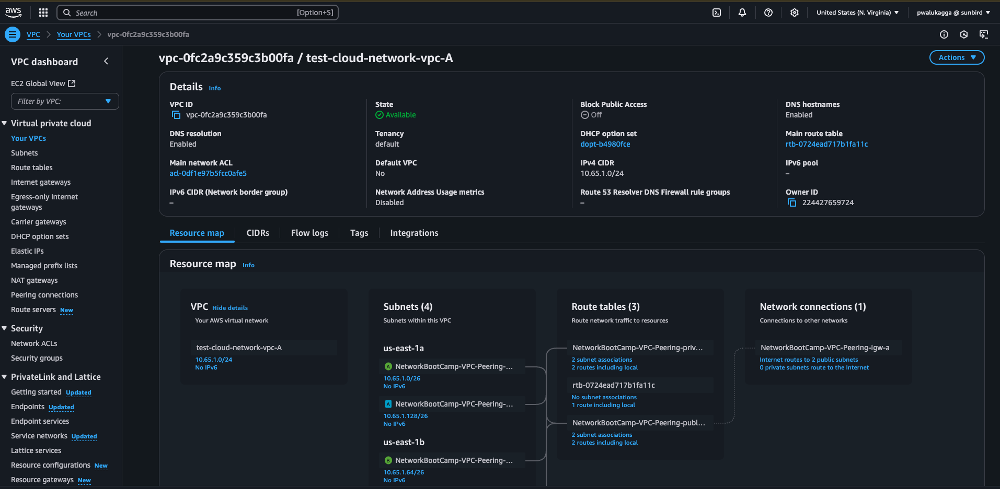

**VPC B (Accepter)**
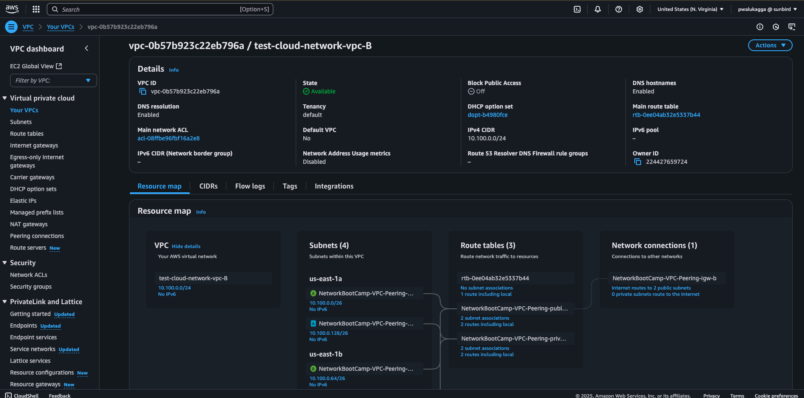

**Peering Connection**
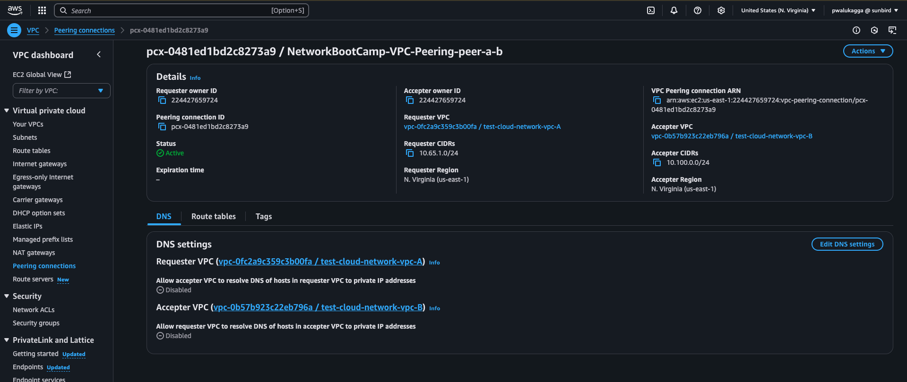
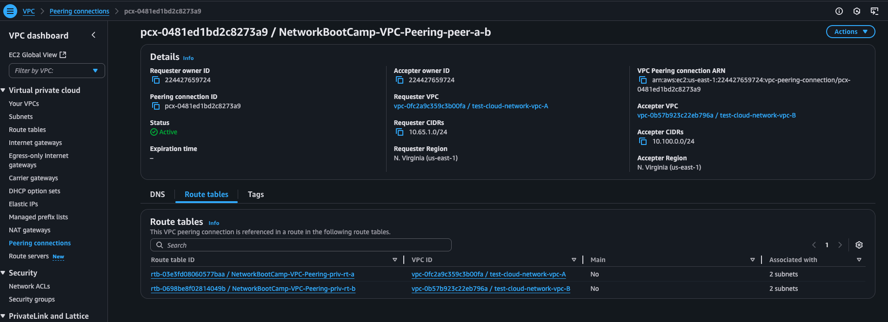

### TODO: Launching Instances in the two VPCs and test connections.

### Clean resources

To delete the provisioned resources run the command below

```sh
./bin/aws/network-delete -p $PROFILE
```