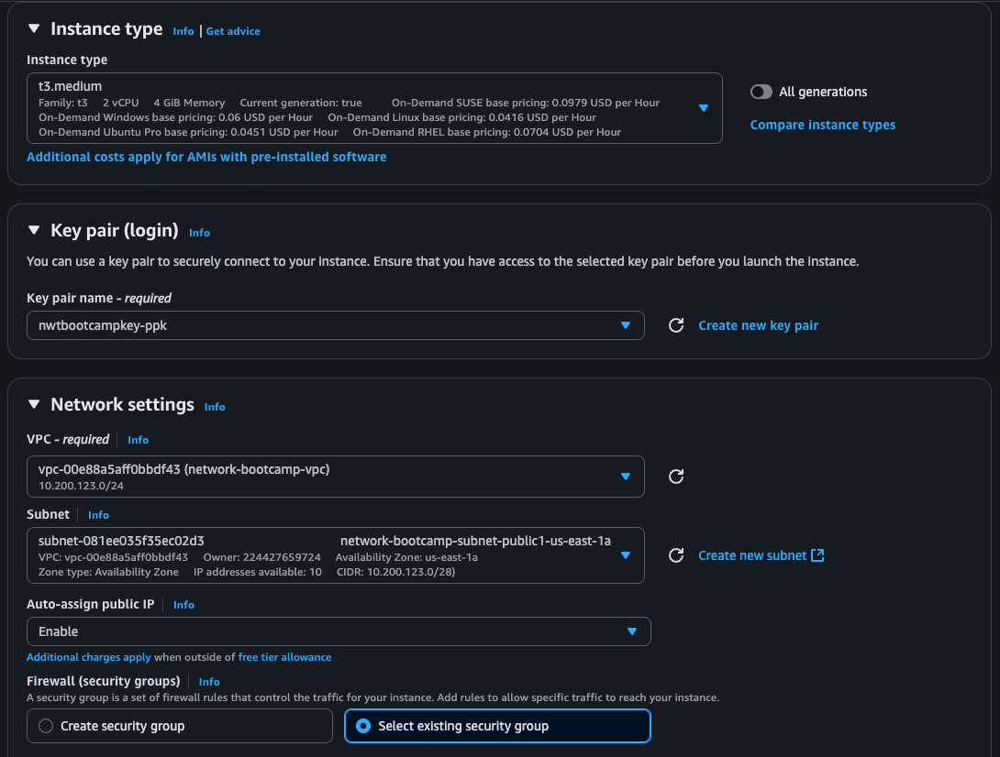
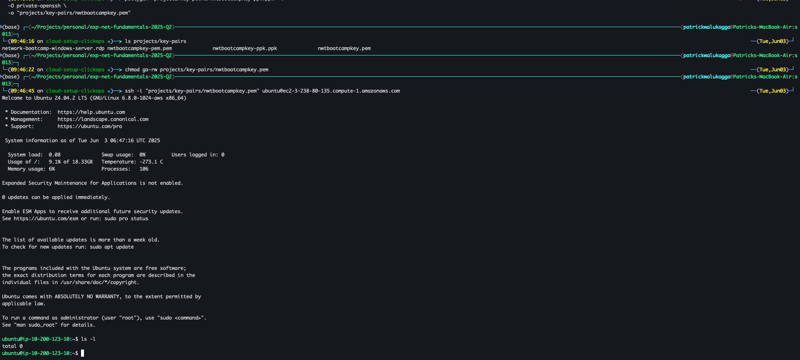

# Setup Cloud Environment using Web Console (ClickOps)

## Launch VPC with One Availability Zone and Subnets

Follow these steps to create a VPC with a single Availability Zone, one public subnet, and one private subnet (VPC CIDR: `10.200.123.0/24`):

1. **Open the VPC Dashboard**  
   

2. **Click Create VPC and More**  
   

3. **Configure Your VPC**  
   - _Name tag_: `network-bootcamp-vpc`  
   - _IPv4 CIDR block_: `10.200.123.0/24`  
   - _Availability Zone_: choose one (e.g., `us-east-1a`)  
   - Leave other settings at defaults  
   

4. **Review and Create**  
   

By default, AWS will create one public and one private subnet in your chosen AZ using the specified CIDR block. Verify both subnets under **Subnets** in the VPC console (look for tags like `network-bootcamp-PublicSubnetAZ1` and `network-bootcamp-PrivateSubnetAZ1`).

## Create Key Pairs

Follow these steps to generate key pairs for SSH and RDP access:

1. **Navigate to Key Pairs**  
   

2. **Create PEM Key Pair**  
   - _Key pair name_: `network-bootcamp-key`  
   - _File format_: `pem`  
   

3. **Create PPK Key Pair (Windows)**  
   - _Key pair name_: `network-bootcamp-key`  
   - _File format_: `ppk`  
   

**Key Pair Details and Best Practices**  
- AWS key pairs provide secure SSH/RDP authentication for EC2 instances without passwords.  
- The `.pem` private key is used with Linux/macOS SSH clients (`ssh -i nwtbootcampkey.pem ec2-user@<public-ip>`).  
- The `.ppk` private key is used with PuTTY on Windows; import `.pem` into PuTTYgen to generate `.ppk`.  
- Restrict permissions on your private keys: `chmod 400 nwtbootcampkey.pem`.  
- Store keys securely—do not commit them to version control or share publicly.  
- You can associate this key pair with any new EC2 instance in the same region and account.  

## Launch Windows Server EC2 Instance

Follow these steps to launch a Windows Server EC2 instance:

1. **Open the EC2 Console**  
   

2. **Click Launch Instance**  
   

3. **Select a Free Tier Eligible Windows AMI**  
   

4. **Choose Instance Type**  
   - _Instance type_: `t3.large`  
   

5. **Configure Instance Details**  
   - _Network_: `network-bootcamp-vpc`  
   - _Subnet_: `network-bootcamp-PublicSubnetAZ1`  
   - _Auto-assign Public IP_: Enable  
   

6. **Select Key Pair**  
   - _Key pair name_: `network-bootcamp-key` (pem)  
   

7. **Add Security Group**  
   - _Security group name_: `allow-rdp-login`  
   - _Inbound rules_:  
     - **RDP**: Source = My IP  
     - **All traffic**: Source = `10.200.123.0/24`  
   

   **Security Group Rationale**  
   - **RDP (TCP 3389)** with _My IP_ ensures that only your current public address can initiate remote desktop sessions, reducing exposure to unauthorized access.  
   - **All traffic** with _Custom: 10.200.123.0/24_ allows unrestricted communication between instances in your VPC (public and private subnets) for management and inter-service traffic without opening ports to the internet.

8. **Review and Launch**  
   Verify your settings and click **Launch** to start the instance.

## Launch and Attach Network Interface (ENA)

Follow these steps to create a secondary network interface in your VPC and attach it to the Windows instance:

1. **Open Network Interfaces**  
   

2. **Create Network Interface**  
   - _Description_: `network-bootcamp-nic`  
   - _Interface type_: `ena`  
   - _Subnet_: `network-bootcamp-PrivateSubnetAZ1`  
   - _Auto-assign private IP_: Enable  
   - _Security group_: `allow-rdp-login`  
   

3. **Attach Network Interface**  
   - Select the NIC `network-bootcamp-nic`  
   - Click **Actions > Attach**  
   - Choose **Instance**: your Windows Server instance  
     
   

**Network Interface Rationale**  
- Separates management and application traffic by using a secondary ENA, improving security and network segmentation.  
- Enables you to move or reassign the interface between instances without recreating configurations.

## Connect to Windows Instance via RDP

Follow these steps to connect to your Windows Server using a Remote Desktop client:

1. **Open the EC2 console and select your instance**  
   

2. **Click Connect**  
   

3. **Download Remote Desktop File**  
   - Click **Download remote desktop file**  
   

4. **Retrieve Windows Administrator Password**  
   - Click **Get password**  
   - Upload your private key file (`nwtbootcampkey.pem`)  
   

   - Click **Decrypt Password** to reveal the Administrator password  

5. **Launch RDP Client**  
   - Open the downloaded `.rdp` file using Microsoft Remote Desktop (macOS/Windows)  
   - Enter the decrypted Administrator password when prompted  

   

   

**RDP Connection Tips**  
- Ensure your security group allows RDP from your IP.  
- Save the `.rdp` file and password securely for future sessions.  
- Use the `network-bootcamp-key.pem.pem` or converted credentials as needed on Windows machines.

## Launch Ubuntu Server EC2 Instance

Follow these steps to launch an Ubuntu EC2 instance:

1. **Open the EC2 Console**  
   
2. **Click Launch Instance**  

3. **Select a Free Tier Eligible Ubuntu AMI** 
   


4. **Choose Instance Type**  
   - _Instance type_: `t3.medium`
   

5. **Configure Instance Details**  
   - _Network_: `network-bootcamp-vpc`  
   - _Subnet_: `network-bootcamp-PublicSubnetAZ1`  
   - _Auto-assign Public IP_: Enable  
   

6. **Select Key Pair**  
   - _Key pair name_: `network-bootcamp-key` (ppk)  
   

7. **Configure Security Group**  
   - _Security group_: `allow-rdp-login` (existing)  
   - Click **Edit security group**  
   - Add **SSH**: Source = My IP  
   

8. **Review and Launch**  
   Click **Launch** to start the Ubuntu instance.
   

## Launch and Attach Network Interface to Ubuntu Instance

Follow these steps to create a secondary network interface (ENA) in your VPC and attach it to the Ubuntu instance:

1. **Open Network Interfaces**  

2. **Create Network Interface**  
   - _Description_: `network-bootcamp-nic`  
   - _Interface type_: `ena`  
   - _Subnet_: `network-bootcamp-PrivateSubnetAZ1`  
   - _Auto-assign private IP_: Enable  
   - _Security group_: `allow-rdp-login`  
   
   

3. **Attach Network Interface**  
   - Select the NIC `network-bootcamp-nic`  
   - Click **Actions > Attach**  
   - Choose **Instance**: your Ubuntu Server instance  
   

**Network Interface Rationale**  
- Improves network segmentation by isolating management or application traffic.  
- Enables you to move or reassign the interface independently of the instance configuration.

## Connect to Ubuntu Instance via SSH (PuTTY / Native SSH)

Follow these steps to access your Ubuntu instance using PuTTY (Windows/macOS) or the native SSH client on Linux/macOS:

1. **Install PuTTY and PuTTYgen**  
   - Windows: Download from [putty.org](https://www.putty.org/)  
   - macOS: Follow instructions at [SSH.com PuTTY on Mac](https://www.ssh.com/academy/ssh/putty/mac)  

2. **Generate / Load SSH Key in PuTTY and PuTTYgen (Windows)**  
   - Open **PuTTYgen** and click **Load**  
   - Select your private key file `nwtbootcampkey.pem`  
   - Click **Save private key** to export as `.ppk`  

3. **Connect with PuTTY and puttygen (Windows)**  
   - Open **PuTTY**  
   - _Host Name_: `ubuntu@<public-ip>`  
   - Under **Connection → SSH → Auth**, browse to your `.ppk` file  
   - Click **Open** to start the SSH session  

4. **Connect Using Native SSH (macOS)**  
```bash
# Convert PuTTY PPK to OpenSSH PEM format
puttygen "projects/key-pairs/nwtbootcampkey-ppk.ppk" -O private-openssh -o "projects/key-pairs/nwtbootcampkey.pem"

# Restrict private key permissions
chmod go-rw projects/key-pairs/nwtbootcampkey.pem

# SSH into Ubuntu instance (replace with your public DNS)
ssh -i "projects/key-pairs/nwtbootcampkey.pem" ubuntu@ec2-3-238-80-135.compute-1.amazonaws.com
```

   

**SSH Connection Tips**  
- Ensure your security group allows SSH (TCP 22) from your IP.  
- Replace `<public-ip>` with the instance’s public IPv4 address from the EC2 console.  
- Keep your private key secure; never share or commit it.

