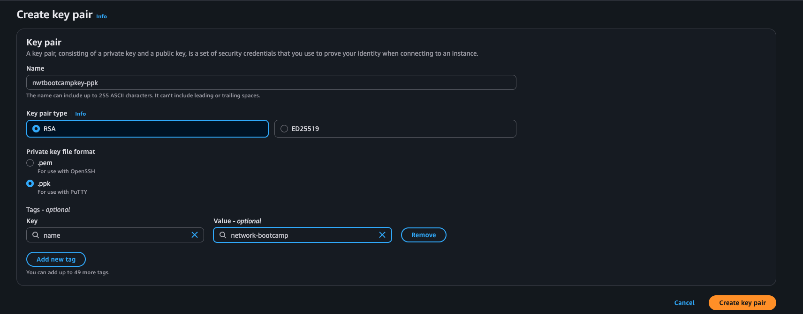

# Setup Cloud Environment using Web Console (ClickOps)

## Launch VPC with One Availability Zone and Subnets

Follow these steps to create a VPC with a single Availability Zone, one public subnet, and one private subnet (VPC CIDR: `10.200.123.0/24`):

1. **Open the VPC Dashboard**  
   

2. **Click Create VPC and More**  
   

3. **Configure Your VPC**  
   - _Name tag_: `network-bootcamp-vpc`  
   - _IPv4 CIDR block_: `10.200.123.0/24`  
   - _Availability Zone_: choose one (e.g., `us-east-1a`)  
   - Leave other settings at defaults  
   

4. **Review and Create**  
   

By default, AWS will create one public and one private subnet in your chosen AZ using the specified CIDR block. Verify both subnets under **Subnets** in the VPC console (look for tags like `network-bootcamp-PublicSubnetAZ1` and `network-bootcamp-PrivateSubnetAZ1`).

## Create Key Pairs

Follow these steps to generate key pairs for SSH and RDP access:

1. **Navigate to Key Pairs**  
   

2. **Create PEM Key Pair**  
   - _Key pair name_: `network-bootcamp-key`  
   - _File format_: `pem`  
   

3. **Create PPK Key Pair (Windows)**  
   - _Key pair name_: `network-bootcamp-key`  
   - _File format_: `ppk`  
   
