# IP Address Management

## Windows Network Interfaces
For the launched windows instances we see that we have a public network interface to allow connect to the internet which is created on launch and a private network interface which is attached in private subnet to allow network communication internally.

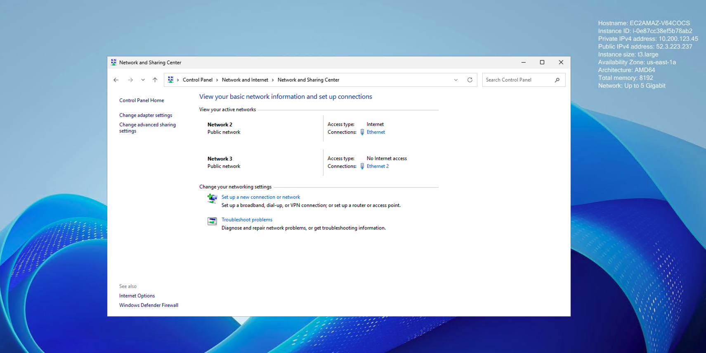
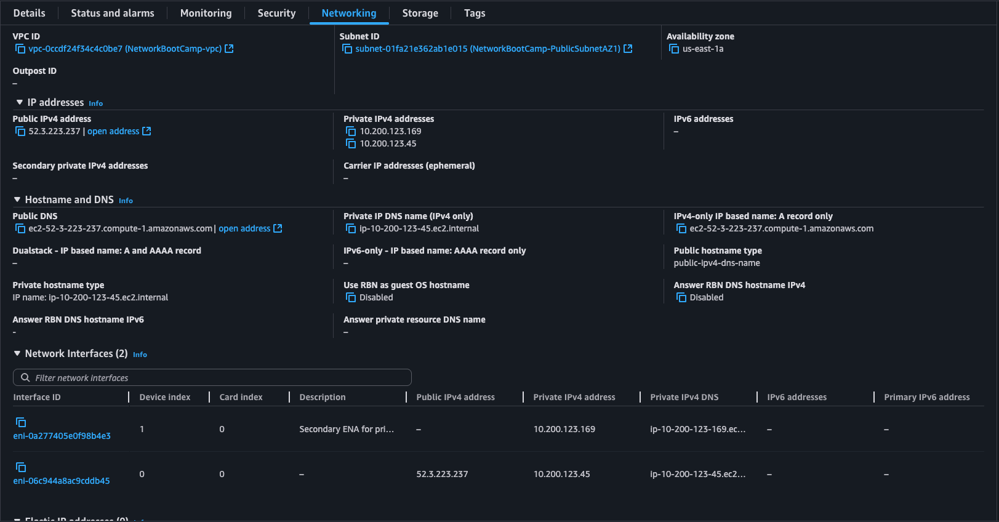

### Public Network Interface Details

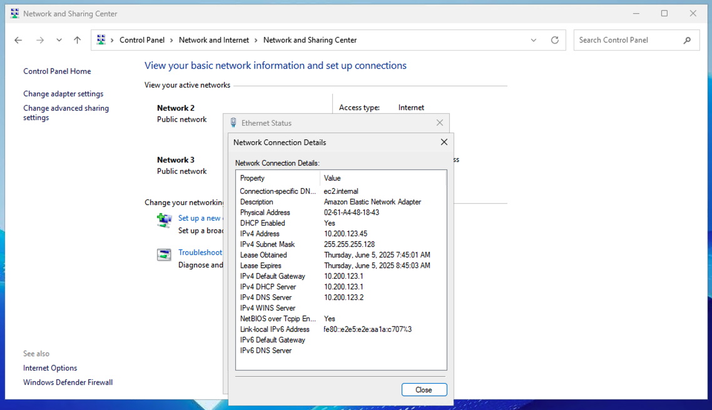
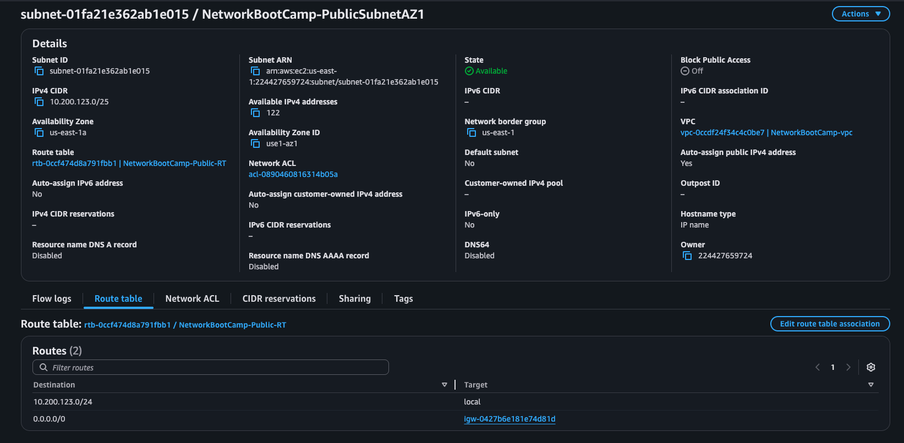

#### Subnet-to-ENI Mapping (Public Interface)

- The primary ENI is created in the public subnet (e.g., `10.200.123.0/24`), so its primary private IP is drawn from this subnet’s CIDR.
- AWS attaches a public IPv4 address to this ENI via the Internet Gateway associated with the VPC, enabling internet connectivity.
- On EC2 launch, this ENI is bound at device index 0 of the instance.

#### Technical Explanation of IP Assignments

- **Primary Private IP**  
  Automatically allocated from the subnet CIDR (e.g., `10.200.123.45`) when the ENI is created or attached. This IP is the interface’s main address used for all inbound/outbound VPC traffic.  
- **Public IPv4 Address**  
  When _Auto-assign Public IP_ is enabled, AWS allocates a public IP from the AWS pool and maps it to the primary private IP via the Internet Gateway (IGW). This address (e.g., `3.238.80.135`) is reachable from the internet.  
- **Elastic Network Interface (ENI)**  
  The ENI resource (`eni-0abcdef1234567890`) binds both IPs and carries metadata such as MAC address, security groups, and source/dest check settings.

### Viewing and Modifying IPs with AWS CLI

```bash
# Describe the network interface
aws ec2 describe-network-interfaces \
  --network-interface-ids eni-0abcdef1234567890 \
  --profile $PROFILE

aws ec2 describe-network-interfaces \
  --network-interface-ids eni-06c944a8ac9cddb45 \
  --profile $PROFILE

# Allocate a new Elastic IP for VPC
aws ec2 allocate-address \
  --domain vpc \
  --profile $PROFILE

# Associate the Elastic IP to the ENI
aws ec2 associate-address \
  --allocation-id eipalloc-0123456789abcdef0 \
  --network-interface-id eni-0abcdef1234567890 \
  --profile $PROFILE

# Assign an additional private IP to the ENI
aws ec2 assign-private-ip-addresses \
  --network-interface-id eni-0abcdef1234567890 \
  --private-ip-addresses 10.200.123.50 \
  --profile $PROFILE
```

Replace IDs and IPs with those from your environment to replicate or update assignments in AWS.

### Private Network Interface Details

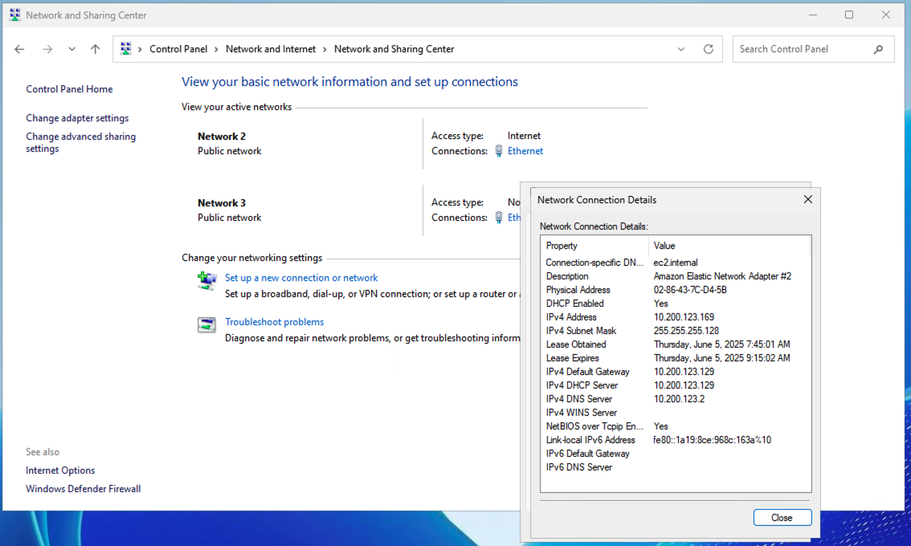
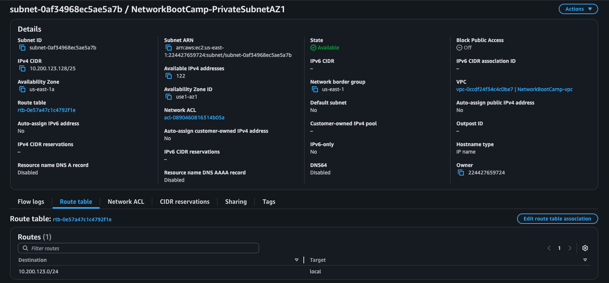

#### Subnet-to-ENI Mapping (Private Interface)

- The secondary ENI is placed in the private subnet (e.g., `10.200.123.0/24`), so its IPs come from the private subnet’s CIDR block.
- Since the private subnet lacks a direct IGW route, this ENI has no public IP; its traffic routes via a NAT Gateway/instance in the public subnet.
- This ENI attaches at device index 1 on the instance, isolating internal management/data traffic.

#### Technical Explanation for Private Network Interface

- **Primary Private IP**  
  Automatically assigned from the private subnet CIDR (e.g., `10.200.123.100`) when the ENI is created or attached. This IP handles all VPC-internal traffic and can be used for instance-to-instance communication without traversing the Internet Gateway.  
- **Secondary Private IPs**  
  You can assign additional private IP addresses to the ENI for hosting multiple applications or services on a single instance. These extra addresses (e.g., `10.200.123.110`, `10.200.123.120`) are in the same subnet and routed internally.  
- **No Public IPv4 Address**  
  Since the ENI is in a private subnet, it does not receive an auto-assigned public IP; all outbound internet traffic would flow through a NAT Gateway or NAT Instance in the public subnet.  

#### Managing Private IPs with AWS CLI

```bash
# Describe the private ENI to view its IPs
aws ec2 describe-network-interfaces \
  --network-interface-ids eni-06c944a8ac9cddb45 \
  --query 'NetworkInterfaces[0].PrivateIpAddresses' \
  --profile $PROFILE

# Assign a secondary private IP to the ENI
aws ec2 assign-private-ip-addresses \
  --network-interface-id eni-06c944a8ac9cddb45 \
  --secondary-private-ip-address-count 1 \
  --profile $PROFILE
  # or specify exact IPs:
  # --private-ip-addresses 10.200.123.110

# Unassign a secondary private IP from the ENI
aws ec2 unassign-private-ip-addresses \
  --network-interface-id eni-06c944a8ac9cddb45 \
  --private-ip-addresses 10.200.123.110 \
  --profile $PROFILE
```

### Windows ipconfig

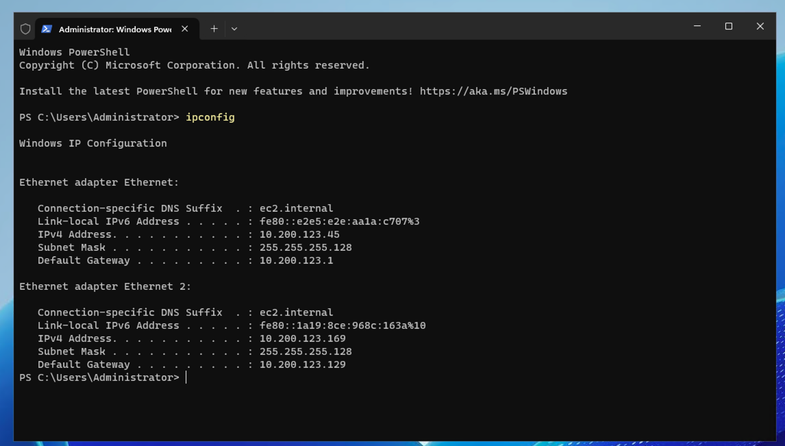

#### Understanding `ipconfig` Output

- **Command**: `ipconfig` is a built-in Windows command-line utility that displays the IP configuration of all network adapters on the system.
- **IPv4 Address**: Shows the primary private IP assigned to each interface (e.g., `10.200.123.45`).
- **Subnet Mask**: Indicates the network mask (e.g., `255.255.255.0`) used to determine the host and network portions of the IP address.
- **Default Gateway**: Lists the gateway IP (typically the VPC router or NAT device) used for outbound traffic to other networks or the internet.

By running `ipconfig` on the Windows EC2 instance, you can verify that the primary ENI (device index 0) has its expected private IP/subnet configuration and default gateway pointing to the VPC router.

#### ipconfig /all

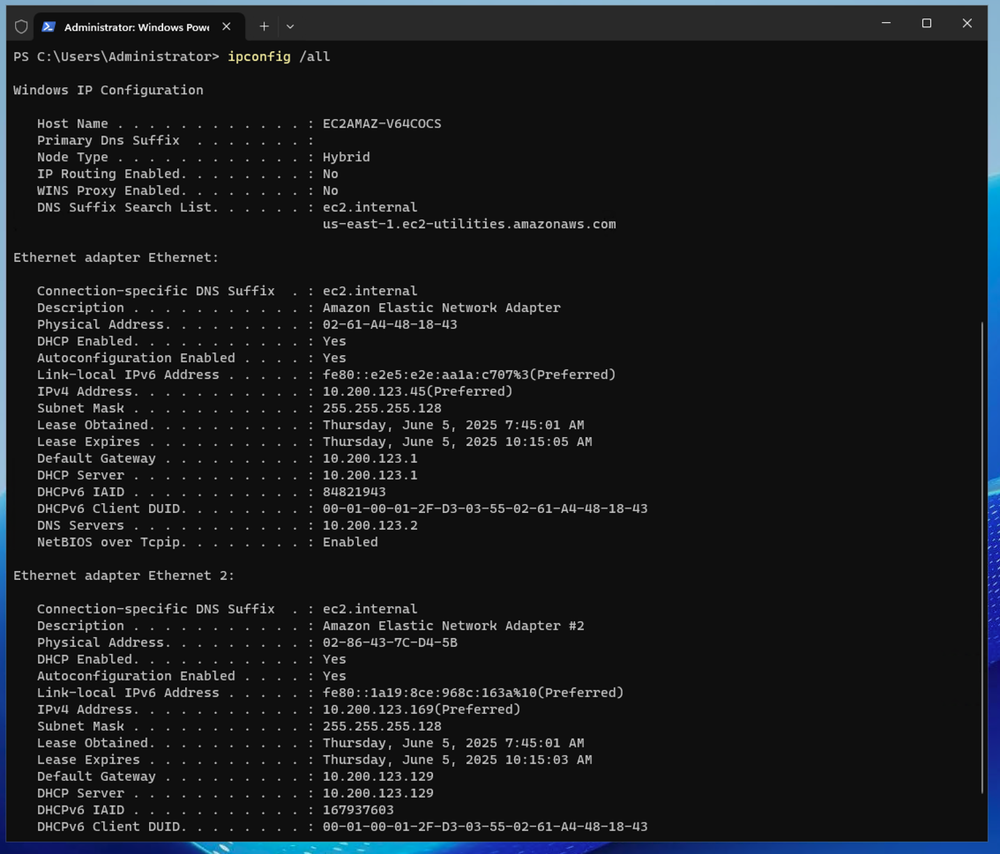

#### Understanding `ipconfig /all` Output

- **Host Name & Primary DNS Suffix**  
  Shows the Windows computer name and DNS domain (if configured) used for network identification.
- **Physical Address (MAC)**  
  The hardware address of each network adapter (e.g., `02-42-0A-C8-7B-2D`) used for Ethernet-level communication.
- **DHCP Enabled & DHCP Server**  
  Indicates whether the adapter obtained its IP from DHCP and the server’s IP address.
- **Lease Obtained / Lease Expires**  
  Displays the DHCP lease timing, useful for troubleshooting address renewal issues.
- **DNS Servers**  
  Lists the IP addresses of DNS resolvers assigned to the adapter.
- **NetBIOS over Tcpip**  
  Specifies whether NetBIOS name resolution is enabled, affecting legacy Windows networking.

Use `ipconfig /all` when you need a comprehensive view of all network adapter settings and DHCP/DNS configurations.

### DHCP Overview

- **DHCP (Dynamic Host Configuration Protocol)** is a network service that automatically assigns IP configuration to clients from a pre-defined pool of addresses. A DHCP server manages IP leases, subnet masks, default gateways, and DNS settings, ensuring devices can join the network without manual configuration.
- **Lease Process**: Clients broadcast a **DHCPDISCOVER**, receive a **DHCPOFFER** with configuration parameters, send a **DHCPREQUEST** to accept, and receive a **DHCPACK** confirming the assignment and lease duration.
- **Renewal & Rebinding**: Before lease expiry, clients request renewal. If the server is unavailable, they attempt rebinding with any available DHCP server.

#### Manual IP Assignment vs DHCP

- **Manual (Static) Assignment**: Admins configure a fixed IP, subnet mask, gateway, and DNS directly on the device.
  - Pros: Predictable, consistent IP addressing; essential for servers and network infrastructure that need stable addresses.
  - Cons: Prone to human error; harder to scale across many devices.
- **DHCP Disabled/Manual for On-prem Devices**:
  - On-premises servers, printers, and specialized equipment often require known, unchanging IPs for service discovery, firewall rules, or routing.
  - Disabling DHCP prevents accidental address changes that could break connectivity in critical infrastructure.
  - Manual IPs can be documented and reserved to avoid IP conflicts.

Use DHCP for general-purpose client devices (workstations, laptops, mobile devices) to simplify management, and static addressing for network-critical hardware requiring consistent network presence.


## Ubuntu IP Address Management

### Ubuntu network interfaces

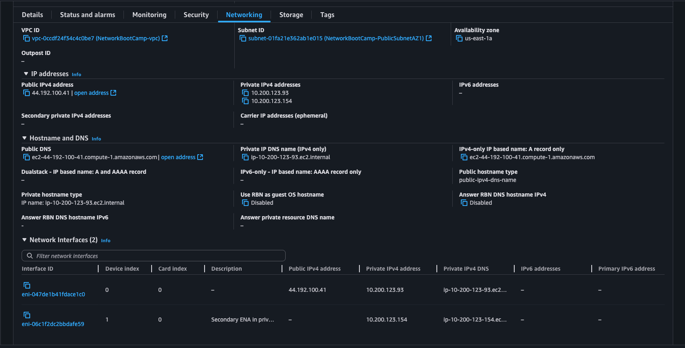

### ip addr

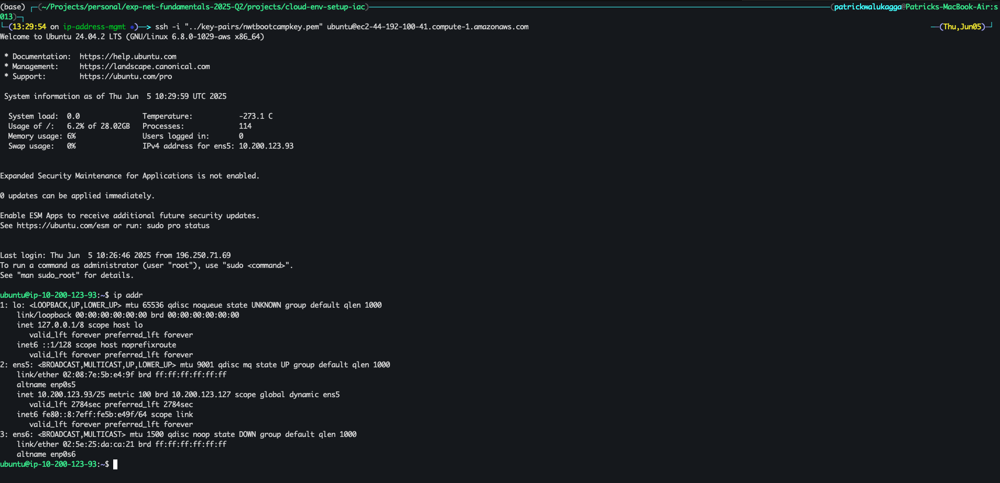

#### Understanding `ip addr` Output

- **Command**: `ip addr` (short for `ip address`) is a Linux utility that displays all network interfaces and their IP address configurations.
- **Interface Index & Name**: Lines like `2: ens5:` show the interface index and system-assigned name (e.g., `ens5` or `eth0`).
- **State**: Flags such as `UP`, `BROADCAST`, `RUNNING`, and `MULTICAST` indicate the interface status and capabilities.
- **link/ether**: Displays the MAC address of the interface (e.g., `02:42:0a:c8:7b:2d`).
- **inet**: Shows the IPv4 address and prefix length (e.g., `10.200.123.45/24`), and the broadcast address (`brd`).
- **scope**: Identifies the address scope (`global` for regular unicast, `link` for link-local).
- **inet6**: Lists any IPv6 addresses with their prefix lengths.

Use `ip addr` to verify interface names, MAC addresses, and assigned IPs directly on Ubuntu EC2 instances.

```sh
ip addr
```

```
1: lo: <LOOPBACK,UP,LOWER_UP> mtu 65536 qdisc noqueue state UNKNOWN group default qlen 1000
    link/loopback 00:00:00:00:00:00 brd 00:00:00:00:00:00
    inet 127.0.0.1/8 scope host lo
       valid_lft forever preferred_lft forever
    inet6 ::1/128 scope host noprefixroute
       valid_lft forever preferred_lft forever
2: ens5: <BROADCAST,MULTICAST,UP,LOWER_UP> mtu 9001 qdisc mq state UP group default qlen 1000
    link/ether 02:08:7e:5b:e4:9f brd ff:ff:ff:ff:ff:ff
    altname enp0s5
    inet 10.200.123.93/25 metric 100 brd 10.200.123.127 scope global dynamic ens5
       valid_lft 2784sec preferred_lft 2784sec
    inet6 fe80::8:7eff:fe5b:e49f/64 scope link
       valid_lft forever preferred_lft forever
3: ens6: <BROADCAST,MULTICAST> mtu 1500 qdisc noop state DOWN group default qlen 1000
    link/ether 02:5e:25:da:ca:21 brd ff:ff:ff:ff:ff:ff
    altname enp0s6
```

#### Detailed Interface Breakdown

1. **Interface 1: lo**  
   - Type: Loopback interface for internal host communication.  
   - `mtu 65536`: Maximum transmission unit (bytes).  
   - `state UNKNOWN`: Always up but not tied to a physical link.  
   - `inet 127.0.0.1/8`: IPv4 loopback address used for local inter-process communication.  
   - `inet6 ::1/128`: IPv6 loopback address.
   - **Purpose & Usage**  
     - Acts as an internal-only interface; packets sent to loopback never leave the host.  
     - Used for local communication and testing (e.g., `localhost` web servers, database connections).  
     - Ensures the OS networking stack is functional even without external network hardware.

2. **Interface 2: ens5**  
   - Type: Primary Ethernet adapter attached at device index 0.  
   - Flags `<BROADCAST,MULTICAST,UP,LOWER_UP>` indicate it supports broadcast, multicast, is administratively up, and link is up.  
   - `mtu 9001`: Maximum Transmission Unit (MTU) in bytes; 9001 indicates jumbo-frame support allowing larger packets (up to 9001 bytes) to reduce per-packet overhead and improve throughput on networks that support jumbo frames.  [Network maximum transmission unit (MTU) for your EC2 instance](https://docs.aws.amazon.com/AWSEC2/latest/UserGuide/network_mtu.html)

   Jumbo frames are simply Ethernet frames whose payload is larger than the standard 1,500-byte Maximum Transmission Unit (MTU). On AWS (and many data-center networks), you can enable an MTU of up to 9,001 bytes on ENA-based interfaces.

    **Why use them?**

    By packing more data into each frame, you reduce per-packet header overhead and the number of interrupts/CPI cycles on the host, which can significantly boost throughput and lower CPU utilization on high-bandwidth links.
    They’re especially valuable for storage traffic (e.g. iSCSI, NFS), big data clusters, or any application moving large blocks of data over a well-controlled network.

    **Caveat**: jumbo frames only work if every hop between source and destination (NICs, switches, routers) supports the larger MTU; otherwise you’ll see dropped packets or need fragmentation.

   - `link/ether 02:08:7e:5b:e4:9f`: MAC address.  
   - `inet 10.200.123.93/25`: Primary private IPv4 and subnet mask (/25 = 128 hosts).  
   - `dynamic`: Address was assigned via DHCP.  
   - `brd 10.200.123.127`: Broadcast address.  
   - `metric 100`: Route metric (or priority) used by the Linux kernel to select the preferred outbound path when multiple routes are available. Lower metric values are favored over higher ones. AWS ENA interfaces default to 100; you can override this (e.g., via `ip route` or `ip addr` commands) to influence which interface handles specific traffic flows.
   - **Purpose & Usage**  
     - Provides external network connectivity and internet access via the public subnet.  
     - Handles all inbound (SSH/RDP) and outbound traffic to/from the instance.  

3. **Interface 3: ens6**  
   - Type: Secondary ENA (private subnet) attached at device index 1.  
   - Flags `<BROADCAST,MULTICAST>` show adapter is up for broadcast/multicast but no active link or IP.  
   - `state DOWN`: Interface is inactive (no cable or no attachment).  
   - `mtu 1500`: Standard Ethernet frame size.  
   - `link/ether 02:5e:25:da:ca:21`: MAC address.  
   - No `inet` entry: No IP assigned until the interface is brought up or secondary private IPs are added.  
   - **Purpose & Usage**  
     - Reserved for internal management and inter-service communication within the VPC.  
     - Once active and assigned, routes private traffic securely without exposure to the internet.

#### Additional `ip addr` Examples

```bash
# Flush all configured IPs from ens6
sudo ip addr flush dev ens6

# Add an IPv6 address to ens6
sudo ip -6 addr add 2001:db8::1/64 dev ens6

# Bring the interface down and up to apply changes
sudo ip link set dev ens6 down
sudo ip link set dev ens6 up
```

### ip route

`ip route` is part of the Linux `iproute2` suite and manages the kernel’s IPv4/IPv6 routing tables. It can display (`show`), add, delete, or modify routes for connecting networks and gateways.

Examples:

```bash
# List all routes
ip route show

# Set a new default gateway
sudo ip route add default via 10.200.123.1 dev ens5 metric 100

# Add a static route to a specific subnet
sudo ip route add 10.200.124.0/24 via 10.200.123.1 dev ens5

# Delete a route
sudo ip route del 10.200.124.0/24
```

Use `ip route` to customize traffic paths or inspect which gateway/interface handles particular destinations.

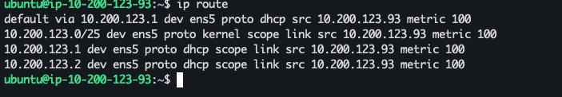

### Understanding `ip route` Output

- **default via <gateway_ip> dev <iface>**  
  Specifies the default route for all outbound traffic, pointing to the VPC router or NAT gateway.  
- **<subnet>/<prefix> dev <iface> proto kernel scope link src <ip_address>**  
  Shows a directly connected subnet route learned by the kernel:  
  - **dev**: interface for the subnet  
  - **scope link**: only valid on this link  
  - **src**: source IP used when sending packets  
- **Metrics & Protocol**  
  - `proto kernel`: route added by kernel during interface initialization  
  - `metric`: route priority, lower wins when multiple matches  

Use `ip route` to inspect and debug the EC2 instance’s routing table, confirming which interfaces handle traffic to each network or the internet.

#### Route Table

- A route table is a set of routing rules maintained by the operating system (or cloud platform) that determines how packets are forwarded to their destinations.
- Each entry consists of a **destination** (CIDR or `default`), a **gateway** or next hop (e.g., VPC router, NAT appliance), and the **interface** (`dev`).
- The kernel performs a **longest-prefix match** against the route table to decide which route applies to each outbound packet.
- In Linux, you manage the instance’s route table with `ip route add/del/show`; in AWS, each subnet is associated with a VPC-level route table controlling network paths (Internet Gateway, NAT Gateway, peering, etc.).
- Metrics and protocols (`proto kernel`, `metric`) influence route priority when multiple entries match.

### netplan

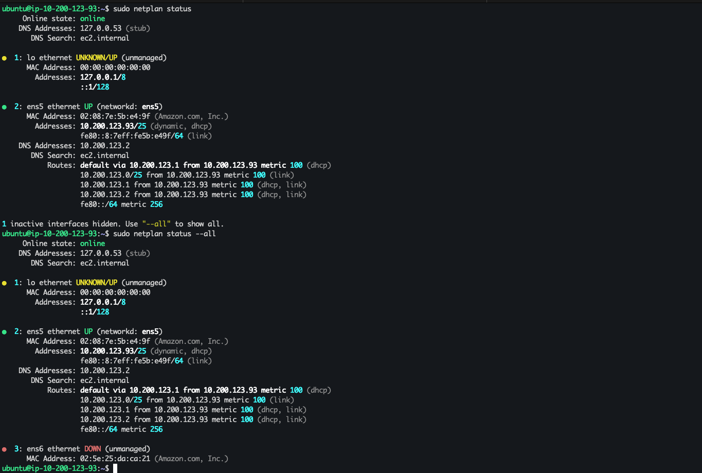

#### Netplan Overview

Netplan is Ubuntu’s declarative network configuration utility (introduced in Ubuntu 17.10) that uses YAML files under `/etc/netplan/` to define interfaces, addressing, routes, and DNS. It abstracts the underlying backend (either `systemd-networkd` or `NetworkManager`), generating the appropriate configuration and applying it uniformly.

Key points:
- Configuration files live in `/etc/netplan/*.yaml`.
- The top-level `network` block specifies `version`, `renderer`, and interface definitions.
- Supports IPv4/IPv6, DHCP, static IPs, VLANs, bonds, bridges, and more.

##### Example Netplan Configuration (`/etc/netplan/01-netcfg.yaml`)
```yaml
network:
  version: 2
  renderer: networkd
  ethernets:
    ens5:
      dhcp4: true          # enable IPv4 via DHCP
      dhcp6: false         # disable IPv6 DHCP
    ens6:
      dhcp4: false         # disable DHCP for ens6
      addresses:
        - 10.200.124.10/24  # static IPv4 address
      gateway4: 10.200.124.1 # default gateway
      nameservers:
        addresses: [8.8.8.8, 8.8.4.4]
```  

##### Common Netplan Commands
- `sudo netplan generate`  : render backend configs without applying
- `sudo netplan apply`     : apply configuration and bring interfaces up
- `sudo netplan try`       : test new config with automatic rollback timer if Connectivity fails

Netplan simplifies and centralizes network management on Ubuntu servers and desktops by providing a clear, version-controlled, and backend-agnostic configuration layer.
