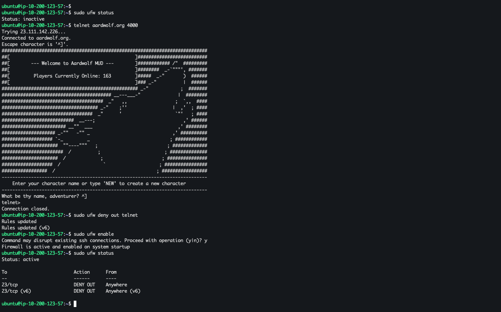
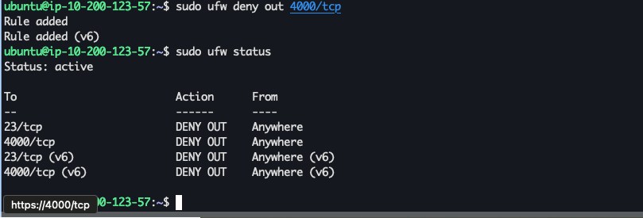
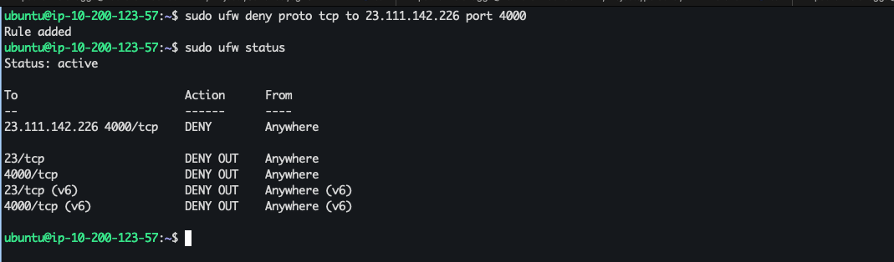
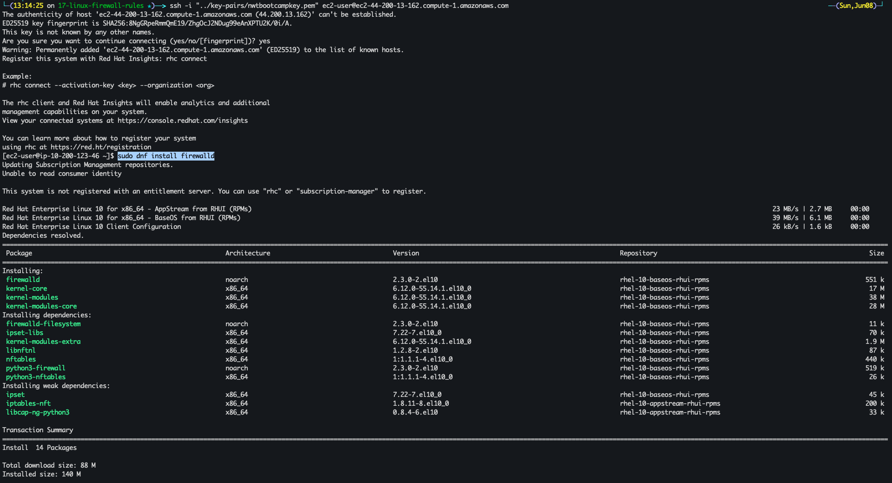
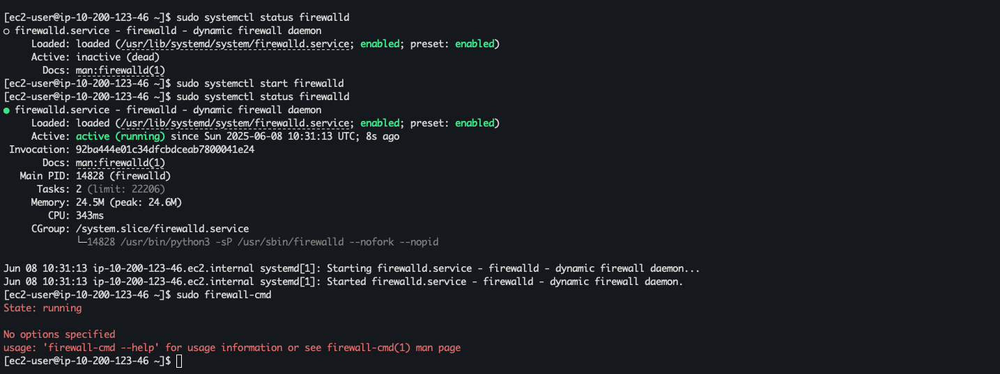
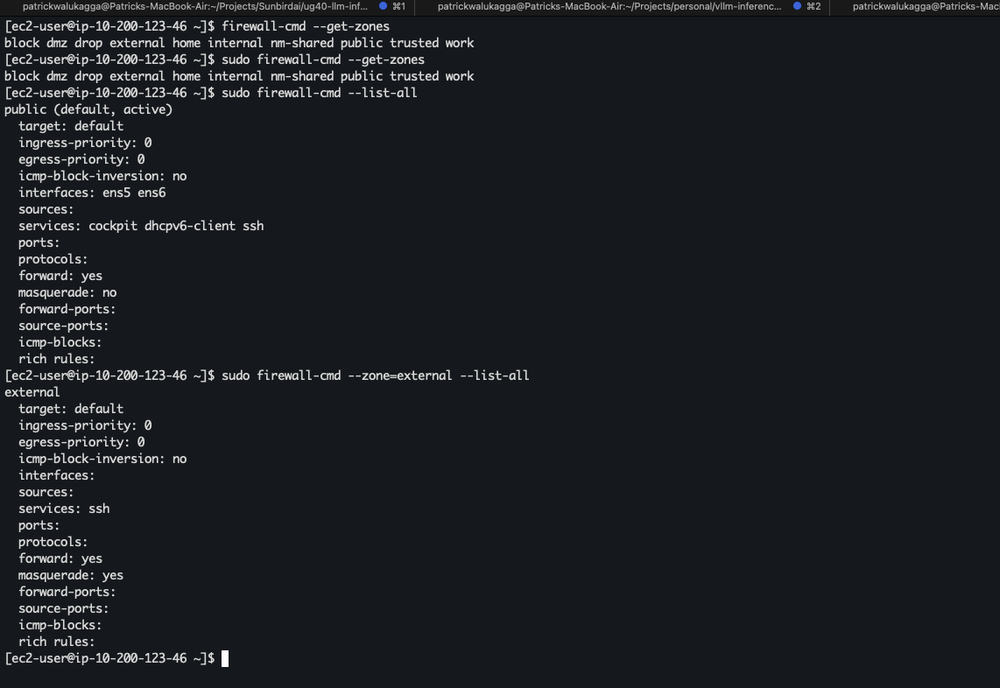

# Linux Firewall Rules

This document provides guidance on controlling network traffic using UFW, firewalld, and iptables on Linux systems.

## UFW

#### Understanding Linux Firewalls & UFW

- **Linux Firewalling**: Managed at kernel level via **iptables** or **nftables**, which filter traffic based on defined rulesets.
- **UFW (Uncomplicated Firewall)**: A high-level, user-friendly wrapper around iptables that simplifies creating and managing firewall rules.
- **Default Policies**: UFW defaults to denying all incoming and allowing all outgoing connections; policies can be adjusted via `ufw default`.
- **Configuration Files**: Rules live under `/etc/ufw/` (e.g., `ufw.conf`, `before.rules`, `after.rules`), while user-added rules are applied via CLI and stored in `/etc/ufw/user.rules`.
- **Basic Workflow**:
  1. **Enable/Disable**: `ufw enable` / `ufw disable`
  2. **View Status**: `ufw status [verbose]`
  3. **Allow/Deny**: `ufw allow|deny [in|out] <port|service|proto>`
  4. **Logging**: `ufw logging on|off` to capture blocked/allowed events.

### ufw status

```sh
sudo ufw status
```

### Create firewall rule to block `telnet` out

> **Note**: It's bad security practice to use telnet on production boxes.

Try to `telnet` to `aardwolf.org`

```sh
telnet aardwolf.org 4000
```

Deny telnet out

```sh
sudo ufw deny out telnet
```

Enable `ufw` and see status

```sh
sudo ufw enable
sudo ufw status
```



Deny out `tcp` on port `4000`

```sh
sudo ufw deny out 4000/tcp
sudo ufw status
```



Now telneting to aardwolf.org on port 4000 doesn't work

```
ubuntu@ip-10-200-123-57:~$ telnet aardwolf.org 4000
Trying 23.111.142.226...
```

Deny tcp to 23.111.142.226 on port `4000`

```sh
sudo ufw deny proto tcp to 23.111.142.226 port 4000
sudo ufw status
```




### ufw manual page

```sh
man ufw
```

## firewalld (Redhat)

- [A beginner's guide to firewalld in Linux](https://www.redhat.com/en/blog/beginners-guide-firewalld)

Install `firewalld`

```sh
sudo dnf install firewalld
```



Start `firewalld`

```sh
sudo systemctl start firewalld
sudo systemctl status firewalld
```

Now let's check the `firewall-cmd` command

```sh
sudo firewall-cmd
```



#### Understanding `firewall-cmd`

- **Role**: Command-line client for `firewalld`, the dynamic firewall daemon on Red Hat–based systems, providing runtime and permanent zone-based rule management.
- **Zones**: Logical groupings (`public`, `internal`, `dmz`, etc.) with specific trust levels and services allowed.  
  - `--get-zones` : List all available zones.  
  - `--get-default-zone` : Show the default zone used for incoming connections.
- **Runtime vs Permanent**:
  - Runtime changes apply immediately but are lost on reload or reboot.  
  - Permanent changes persist across reboots; require `--permanent` flag and a reload.

##### Common Commands
```sh
# Check firewalld status
sudo firewall-cmd --state

# List active zones
sudo firewall-cmd --list-all-zones

# Show services in default zone
default_zone=$(sudo firewall-cmd --get-default-zone)
sudo firewall-cmd --zone=$default_zone --list-services

# Open a TCP port 8000 in the public zone (runtime)
sudo firewall-cmd --zone=public --add-port=8000/tcp

# Make the above change permanent
sudo firewall-cmd --zone=public --add-port=8000/tcp --permanent

# Remove a service (e.g., http)
sudo firewall-cmd --zone=public --remove-service=http --permanent

# Reload firewalld to apply permanent changes
sudo firewall-cmd --reload

# Enable masquerading (network address translation)
sudo firewall-cmd --zone=public --add-masquerade --permanent
```  

Use `firewall-cmd` to manage redhat firewall rules dynamically without restarting the daemon or affecting existing connections.



### firewall-cmd man pages

```sh
man firewall-cmd
```

##### Deny Outbound TCP Port 4000 (??? Didn't complete successfully)
> **Note**: The experimentations below didn't complete succeessfully and I think it was due to the `firewalld` package version.


Block any outgoing connection to remote TCP port 4000 by adding a rich rule in the `public` zone:

Check Active zones

```sh
sudo firewall-cmd --get-active-zones
```

```bash
# Runtime block (effective immediately)
sudo firewall-cmd --zone=public \
  --add-rich-rule='rule family="ipv4" port port="4000" protocol="tcp" drop'

# Persist across reboots
sudo firewall-cmd --zone=public \
  --add-rich-rule='rule family="ipv4" port port="4000" protocol="tcp" drop' \
  --permanent


# Reload to apply permanent changes
sudo firewall-cmd --reload
```

Verify the rule:
```bash
sudo firewall-cmd --zone=public --list-rich-rules
```

To remove that rule again (for example, to reopen port 4000):

```sh
sudo firewall-cmd --zone=public \
  --remove-rich-rule='rule family="ipv4" \
    port port="4000" protocol="tcp" drop' \
  --permanent
sudo firewall-cmd --reload

```

Test by attempting a connection (e.g., `telnet <host> 4000`)—it should now fail.  

Use rich rules to craft fine-grained block policies for egress traffic without touching iptables directly.

## iptables

### Overview
iptables is a legacy command-line tool that interfaces with the Linux kernel's Netfilter framework for packet filtering. iptables works with IPv4 packets; for IPv6, ip6tables is used. It organizes rules into tables (`filter`, `nat`, `mangle`, `raw`) and chains (`INPUT`, `OUTPUT`, `FORWARD`), processing packets sequentially against each rule in a chain.

### Basic Commands

- List all rules with verbose counters:
  ```bash
  sudo iptables -L -n -v
  ```
- Append a rule to a chain:
  ```bash
  sudo iptables -A OUTPUT -p tcp --dport 4000 -j DROP
  ```
- Insert a rule at the top of the chain:
  ```bash
  sudo iptables -I OUTPUT 1 -p tcp --dport 4000 -j DROP
  ```
- Delete a rule by specification:
  ```bash
  sudo iptables -D OUTPUT -p tcp --dport 4000 -j DROP
  ```
- Flush all rules in a chain or table:
  ```bash
  sudo iptables -F
  ```
- Set default policy for a chain:
  ```bash
  sudo iptables -P OUTPUT DROP
  ```

### Persistence

Different distributions handle persistence differently:

- **Debian/Ubuntu**: Install `iptables-persistent`:
  ```bash
  sudo apt install iptables-persistent
  sudo netfilter-persistent save
  ```

- **RHEL/CentOS 7 and earlier**:
  ```bash
  sudo service iptables save
  sudo systemctl restart iptables
  ```

- **RHEL/CentOS 8+**:
  1. Install `iptables-services`:
     ```bash
     sudo yum install iptables-services
     ```
  2. Enable and start:
     ```bash
     sudo systemctl enable iptables
     sudo systemctl start iptables
     ```
  3. Save and restore rules:
     ```bash
     sudo iptables-save > /etc/sysconfig/iptables
     sudo iptables-restore < /etc/sysconfig/iptables
     ```

### Advanced Notes

- **iptables vs nftables**: nftables is the modern replacement for iptables, providing improved performance and a unified syntax for IPv4/IPv6.
- **NAT, Mangle, and Raw Tables**: Explore additional tables for packet alteration (`nat`), header mangling (`mangle`), and raw sockets bypassing connection tracking (`raw`).

### Next Steps

- Add IPv6 examples using `ip6tables`.
- Demonstrate common NAT scenarios (MASQUERADE, DNAT).

