# Linux Networking Tools

## Important Files for DNS

### /etc/hosts

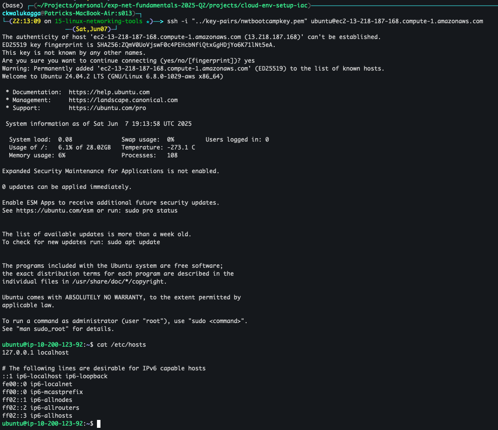

#### Understanding `/etc/hosts`

- **Purpose**: A local, static file that maps IP addresses to hostnames (and optional aliases) before any DNS lookup.
- **Location**: `/etc/hosts` on most Linux distributions; requires root privileges to edit.
- **Syntax**: Each non-comment line contains an IP address, followed by one or more whitespace-separated hostnames. For example:
  ```text
  127.0.0.1   localhost
  10.0.1.15   app-server1 app1
  192.168.0.50 test.example.com test
  ```
- **Precedence**: Lookups consult `/etc/hosts` first (depending on `/etc/nsswitch.conf`), allowing you to override or supplement DNS entries.
- **Common Use Cases**:
  - **Local development**: Redirect a custom domain to `127.0.0.1` for testing web applications.
  - **Temporary overrides**: Test new IPs or migrations without changing public DNS records.
  - **Blocking**: Map unwanted domains to `0.0.0.0` or `127.0.0.1` to block ads or malicious sites.
  - **Quick host aliasing**: Define short, memorable names for servers on private networks without a DNS server.

#### Editing `/etc/hosts`

1. Open the file in an editor with elevated privileges:
   ```bash
   sudo nano /etc/hosts
   ```
2. Add or modify entries as needed, then save and exit.
3. Changes take effect immediately—no service restart is required.

Use `/etc/hosts` as the simplest, fastest method for hostname resolution where DNS is unavailable or to enforce custom mappings locally.

### /etc/systemd/resolved.conf

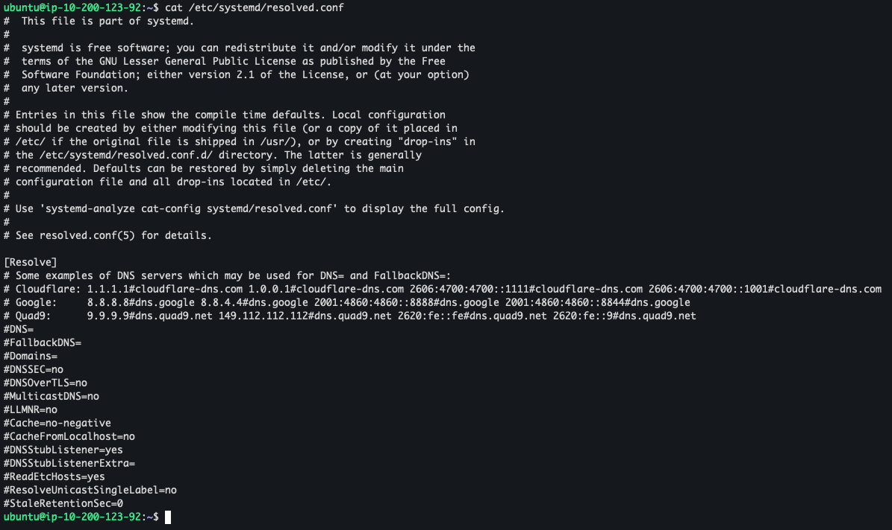

#### Understanding `/etc/systemd/resolved.conf`

- **Purpose**: Configuration file for `systemd-resolved`, the DNS resolver and caching service on many modern Linux distributions.
- **Location**: `/etc/systemd/resolved.conf` (and optional drop-in snippets under `/etc/systemd/resolved.conf.d/`).
- **Sections & Options** (in the `[Resolve]` block):
  - `DNS=`: List of DNS servers to query (e.g., `8.8.8.8 8.8.4.4`).
  - `FallbackDNS=`: Servers used when primary DNS are unreachable.
  - `Domains=`: Search domains or routing domains (prefix with `~` for routing-only).
  - `LLMNR=`: Enable/disable Link-Local Multicast Name Resolution (`yes`/`no`).
  - `MulticastDNS=`: Enable/disable mDNS queries.
  - `DNSSEC=`: DNSSEC mode (`no`, `allow-downgrade`, `yes`).
  - `Cache=`: Enable/disable caching of DNS results.

##### Example Configuration
```ini
[Resolve]
DNS=1.1.1.1 1.0.0.1
FallbackDNS=8.8.8.8 8.8.4.4
Domains=example.com ~.
LLMNR=no
MulticastDNS=no
DNSSEC=allow-downgrade
Cache=yes
```  

##### Applying Changes
```bash
sudo systemctl restart systemd-resolved.service
```  
- After restarting, verify with:
  ```bash
  resolvectl status
  ```  
- Ensure `/etc/resolv.conf` is a symlink to `/run/systemd/resolve/stub-resolv.conf` or the desired resolver file.

**Use Cases**:
- Override default upstream DNS in corporate or VPN environments.
- Configure split-horizon or routing-specific domains.
- Enable DNSSEC validation for enhanced security.
- Centralize DNS caching to improve lookup performance across local clients.

#### Demostrate edit the DNS resolver

Get the DNS resolver status

```sh
resolvectl status
```

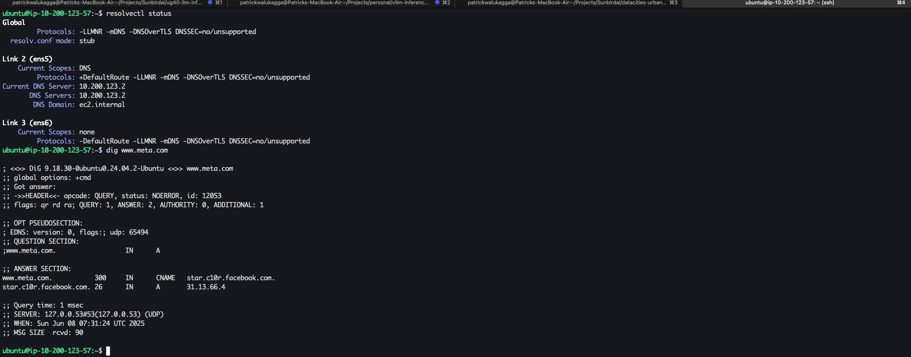

Set the DNS and FallBack DNS

```sh
sudo vim /etc/systemd/resolved.conf
```

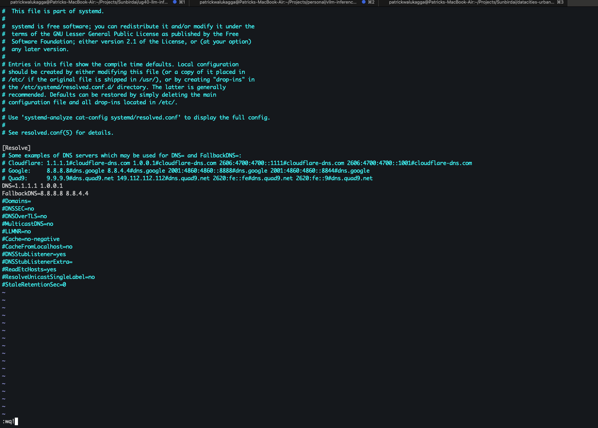

Restart dns resolver service and get status

```sh
sudo systemctl restart systemd-resolved
resolvectl status
```

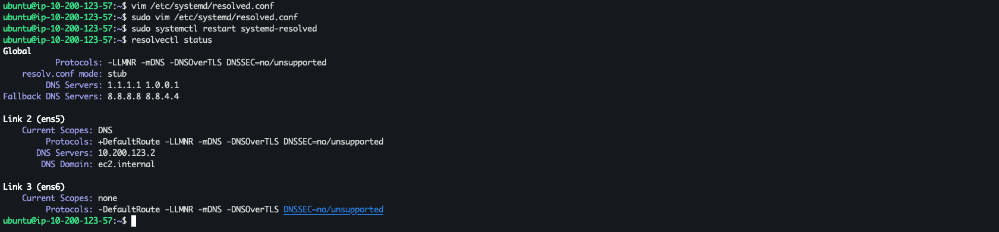

Measure lookup time


## Networking tools

### dig

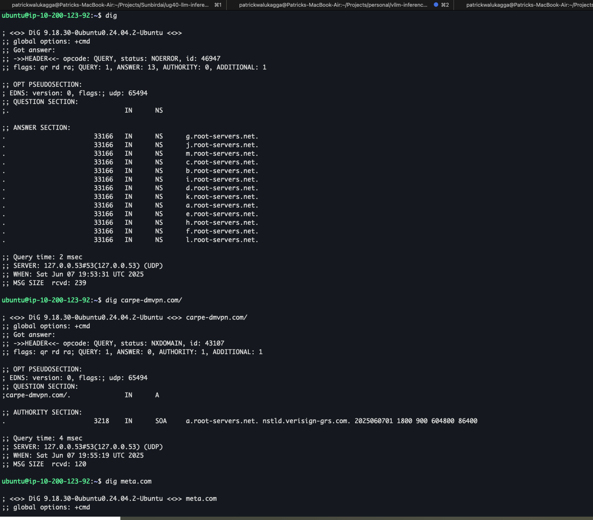

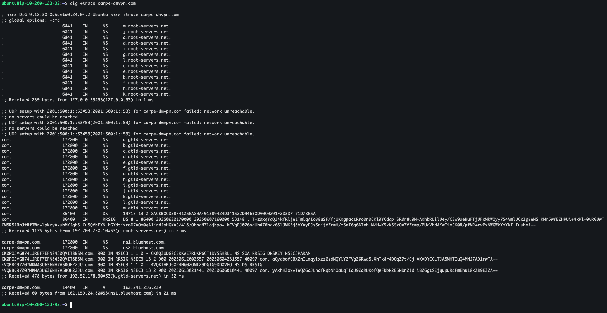

#### Understanding `dig`

- **Command**: `dig` (Domain Information Groper) is a flexible DNS lookup utility used to query DNS servers for information about host addresses, mail exchanges, name servers, and other DNS records.
- **Syntax**: `dig [@server] name [type] [options]`
  - `@server`: DNS server to query (e.g., `@8.8.8.8`).
  - `name`: Domain name or IP address to look up.
  - `type`: Record type (A, AAAA, MX, NS, TXT, SOA, etc.).

##### Common Options
- `+short`: Display concise output showing only the answer section.
- `+trace`: Perform iterative query tracing from the root servers.
- `+noall +answer`: Suppress all sections except the answer.
- `+norecurse`: Request non-recursive query, useful to test specific server behavior.

##### Example Usage
```bash
# Query A record via default DNS
dig example.com A

# Get only IP addresses
dig +short example.com

# Query MX records
dig example.com MX

# Use Google DNS directly
dig @8.8.8.8 example.com

# Trace resolution path from root
dig +trace example.com
```  

**Use Cases**:
- Troubleshoot DNS resolution failures and verify propagation.
- Retrieve specific record types to confirm mail server configurations (`MX`) or SPF entries (`TXT`).
- Measure DNS lookup performance and detect misconfigurations.
- Explore DNS delegation and root server responses with `+trace`.

### netstat

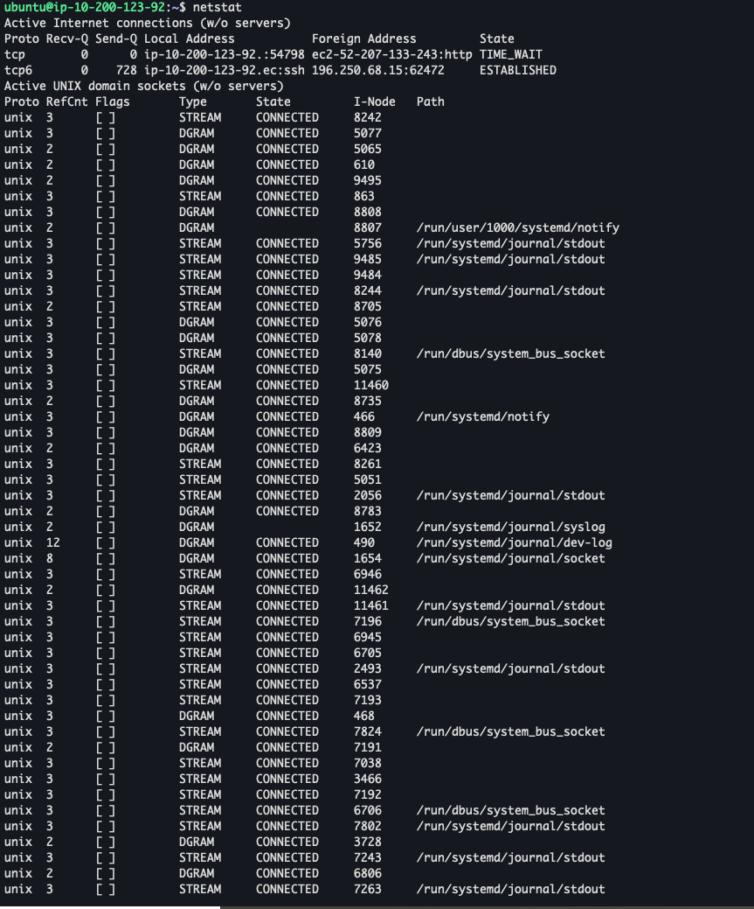

#### Understanding `netstat`

- **Command**: `netstat` (network statistics) is a CLI utility to display active network connections, routing tables, interface statistics, and protocol usage on Linux.

- **Common Options**:
  - `-a` : Show all sockets (listening and non-listening).
  - `-t` : Display TCP connections only.
  - `-u` : Display UDP connections only.
  - `-n` : Show numerical addresses and ports (no DNS resolution).
  - `-p` : Show the PID/program name for each socket (requires root).
  - `-r` : Display the kernel routing table (like `route -n`).
  - `-s` : Display per-protocol statistics (TCP, UDP, ICMP, etc.).

- **Output Columns** (for `netstat -tulnp`):
  - **Proto**: Protocol (tcp, udp).
  - **Recv-Q / Send-Q**: Kernel receive/send queue sizes.
  - **Local Address**: IP and port on the local host.
  - **Foreign Address**: IP and port of the remote host.
  - **State**: Connection state (LISTEN, ESTABLISHED, TIME_WAIT, etc.).
  - **PID/Program name**: Owning process ID and name.

##### Example Usage
```bash
# List listening TCP and UDP ports with PIDs
netstat -tulnp

# Show all connections without DNS lookup
netstat -an

# Display routing table
netstat -rn

# View interface statistics
netstat -i

# Show per-protocol packet statistics
netstat -s
```

**Use Cases**:
- Verify which services are listening on which ports and which processes own them.
- Troubleshoot connection issues by examining socket states and queue backlogs.
- Inspect the system’s routing table to confirm network paths.
- Gather protocol-level statistics to detect errors or performance bottlenecks.

### curl

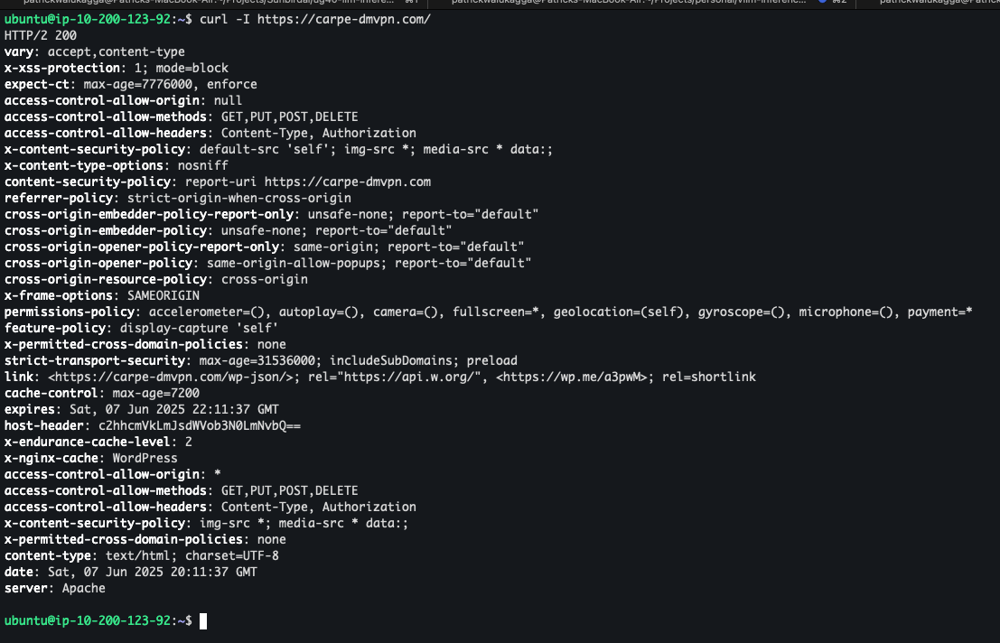

#### Understanding `curl`

- **Command**: `curl` is a versatile command-line tool for transferring data to or from a server using various protocols (HTTP, HTTPS, FTP, SMTP, etc.).
- **Basic Usage**: `curl <URL>` performs a simple GET request and prints the response body to stdout.

##### Common Options
- `-I` or `--head` : Fetch only HTTP headers (HEAD request).
- `-X <method>` : Specify request method (GET, POST, PUT, DELETE, etc.).
- `-d <data>` : Send data in POST or PUT requests (form or JSON payload).
- `-H <header>` : Add custom HTTP header (e.g., `-H "Content-Type: application/json"`).
- `-o <file>` : Write output to a file instead of stdout.
- `-L` : Follow HTTP redirects.
- `-v` : Enable verbose mode to show request/response details.
- `-u <user:pass>` : Provide basic HTTP authentication credentials.

##### Example Usage
```bash
# GET request and print body
curl https://api.example.com/status

# Fetch only headers
curl -I https://api.example.com/status

# Send JSON data via POST
curl -X POST -H "Content-Type: application/json" \
     -d '{"name":"test","id":1}' \
     https://api.example.com/items

# Download file to disk
curl -L https://example.com/archive.tar.gz -o archive.tar.gz

# Basic auth and verbose output
curl -u user:pass -v https://secure.example.com/data
```

**Use Cases**:
- Test and debug RESTful APIs.
- Download or upload files over HTTP/FTP.
- Automate interactions with web services in scripts.
- Diagnose network connectivity and SSL/TLS configurations.

##### More Curl Resources
- [curl.se](https://curl.se/docs/tutorial.html)
- [geeksforgeeks](https://www.geeksforgeeks.org/curl-command-in-linux-with-examples/)


### wget

#### Understanding `wget`

- **Command**: `wget` is a non-interactive network downloader primarily used to fetch files over HTTP, HTTPS, and FTP from the command line.
- **Basic Syntax**: `wget [options] <URL>...`
- **Key Features**:
  - Recursive downloading (`-r`, `-l`).
  - Resume partially downloaded files (`-c`).
  - Background downloading (`-b`).
  - Mirror entire websites (`--mirror`).
  - Automatic file naming and directory creation.

##### Common Options
- `-O <file>` : Write output to `<file>` instead of the default basename.
- `-c` : Continue/Resume a previous download.
- `-b` : Download in the background.
- `-r` : Recursive download (fetch linked documents).
- `-l <depth>` : Set recursion maximum depth.
- `-nc` : No clobber; skip download if file exists.
- `-q` : Quiet mode; no output.

##### Differences from `curl`
- **Specialization**: `wget` is focused on downloading to files and excels at recursive and batch download tasks, while `curl` is a general data-transfer tool that reads/writes data to standard streams.
- **Recursion**: `wget` supports recursive retrieval and site mirroring out of the box; `curl` does not.
- **Resuming**: Both support resume, but `wget`’s `-c` flag is simpler for large file continuation.
- **Output Behavior**: By default, `wget` saves files to disk; `curl` outputs to stdout unless redirected with `-o` or `-O`.
- **Protocol Coverage**: `curl` supports more protocols (SMTP, IMAP, etc.), headers manipulation, and fine-grained HTTP features; `wget` focuses on HTTP, HTTPS, and FTP.

#### Using wget command to download single files

```sh
wget https://wordpress.org/latest.zip
```
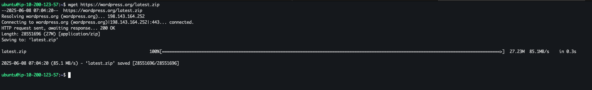

#### Using wget command to download multiple files

```sh
vim example.txt
```

```sh
wget -i example.txt
```

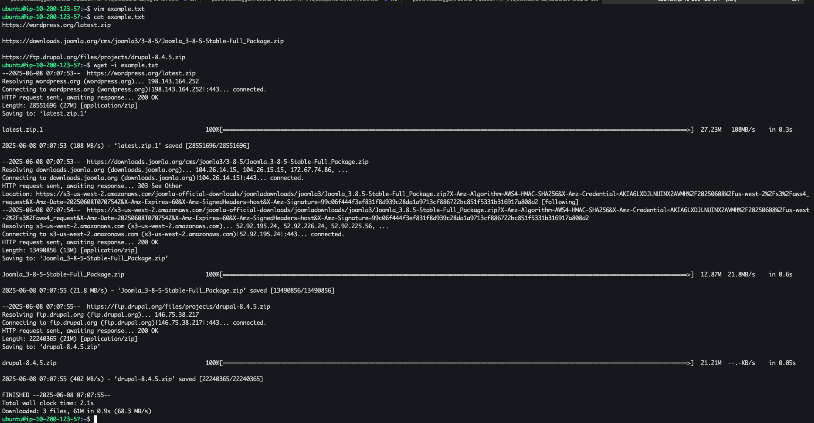
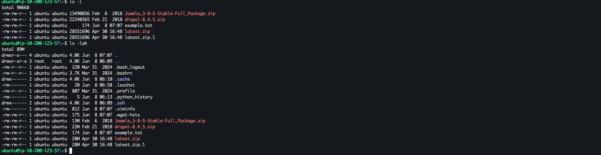

#### Using wget command to get files under different names

```sh
wget -O wordpress-install.zip https://wordpress.org/latest.zip
```

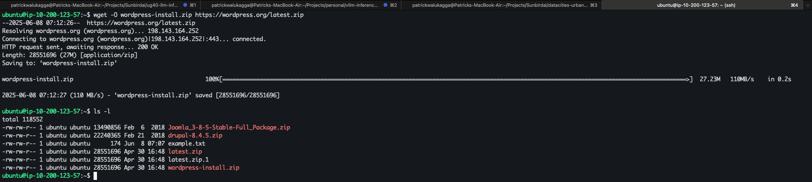

#### More wget resources
- [What is the wget command](https://www.hostinger.com/tutorials/wget-command-examples)
- [Wget Command in Linux/Unix](https://www.geeksforgeeks.org/wget-command-in-linux-unix/)

### lsof

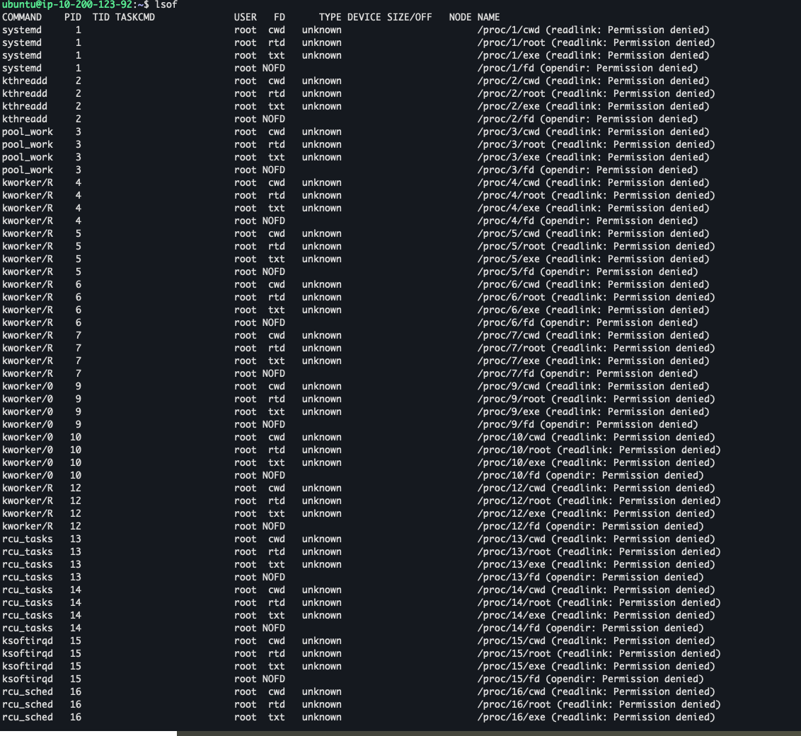

#### Understanding `lsof`

- **Command**: `lsof` (List Open Files) lists all open files and the processes that opened them; on Linux, network sockets and ports appear as file handles.
- **Why "Open Files"?**: In Unix, almost everything is treated as a file (including network connections, devices, and pipes), so `lsof` provides a unified view of all these handles.

##### Common Options
- `-i` : Show network files (e.g., `lsof -iTCP -sTCP:LISTEN` for listening TCP ports).
- `-i:<port>` : Filter by port number (e.g., `lsof -i:80`).
- `-nP` : Disable host and port name conversion (numeric output only).
- `-p <PID>` : List files opened by a specific process.
- `-u <user>` : List files opened by a specific user.
- `-t` : Output only PIDs (useful for scripting).

##### Example Usage
```bash
# Show all processes listening on TCP ports
lsof -iTCP -sTCP:LISTEN

# Find which process is using port 443
lsof -nP -i:443

# List network connections by user 'www-data'
sudo lsof -i -u www-data

# Kill processes listening on port 3000
kill -9 $(lsof -t -i:3000)

# Show all open files for PID 1234
lsof -p 1234
```

**Use Cases**:
- Determine which process is bound to a specific port (e.g., debugging port conflicts).
- Audit active network connections and the owning processes.
- Scripted cleanup of orphaned services or sockets.
- Investigate file descriptor leaks by listing open handles per process.

### tcpdump

#### Understanding `tcpdump`

- **Command**: `tcpdump` is a packet analyzer that captures and displays network traffic flowing through an interface.
- **Basic Syntax**: `tcpdump [options] [filter-expression]`

##### Common Options
- `-i <interface>` : Specify the network interface (e.g., `-i eth0`). Use `-i any` to capture on all.
- `-n` : Don't convert addresses (host/port) to names (numeric output).
- `-v`, `-vv`, `-vvv` : Increase verbosity of output.
- `-c <count>` : Capture only `<count>` packets.
- `-w <file>` : Write raw packets to a capture file (PCAP) for later analysis.
- `-r <file>` : Read packets from a saved PCAP file.
- `-s <snaplen>` : Capture only the first `<snaplen>` bytes of each packet (defaults to 96 or 65535).
- `-X` : Show packet contents in both hex and ASCII.

##### Filter Expressions
- **Host**: `host 192.168.1.10` captures traffic to/from that IP.
- **Port**: `port 80` or `tcp port 443` filters by port.
- **Network**: `net 10.0.0.0/24` captures subnet traffic.
- **Combined**: Use `and`, `or`, `not`, e.g., `tcp and port 22 and host 10.0.0.5`.

##### Example Usage
```bash
# Capture 100 packets on eth0 and display summary
sudo tcpdump -i eth0 -c 100

# Capture HTTP traffic (port 80) verbosely
sudo tcpdump -i any -n -v 'tcp port 80'

# Write capture to file
sudo tcpdump -i eth0 -w capture.pcap

# Read and print saved packets
tcpdump -r capture.pcap -n -X
```  

**Use Cases**:
- Diagnose network connectivity issues by inspecting packet flows.
- Analyze protocols and detect malformed or rogue traffic.
- Debug application-level traffic (HTTP, DNS, TCP handshakes).
- Capture data for forensic or performance analysis using Wireshark.