# Getting Started with Cisco Packet Tracer

## Simple Network

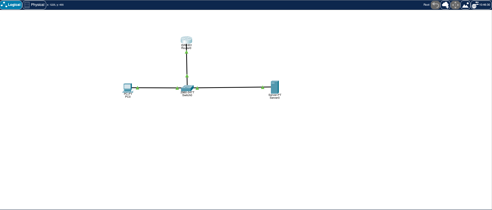

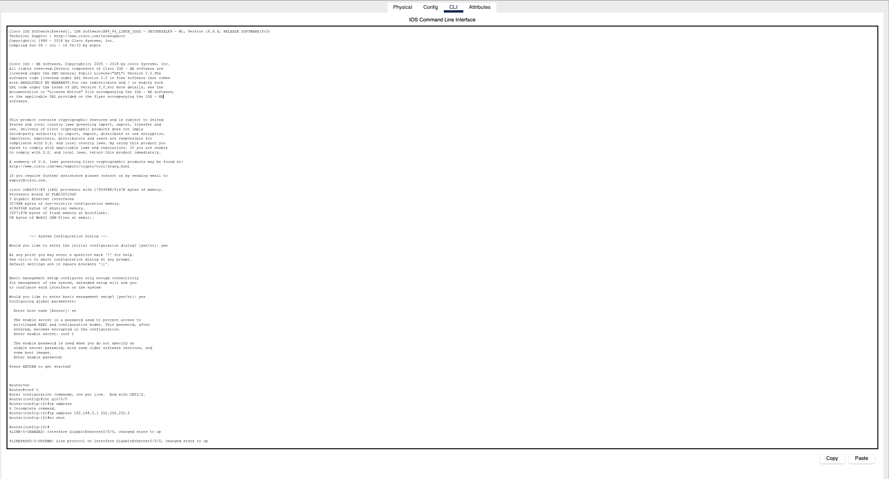

## Configuring the Router

After launching Packet Tracer and placing a router, use the IOS CLI to set up an IP address on the Gigabit interface and bring it online:

```text
Router> en
```  
- `en` (enable): Elevates from user EXEC mode to privileged EXEC mode, giving access to configuration commands.

```text
Router# conf t
```  
- `conf t` (configure terminal): Enters global configuration mode, where you can modify device settings.

```text
Router(config)# int gi0/0/0
```  
- `int gi0/0/0` (interface GigabitEthernet0/0/0): Selects the first GigabitEthernet interface for configuration.

```text
Router(config-if)# ip address
% Incomplete command.
```  
- Typing `ip address` alone shows that you must supply both an IP address and subnet mask.

```text
Router(config-if)# ip address 192.168.0.1 255.255.255.0
```  
- Sets the interface IPv4 address to `192.168.0.1` with a `/24` subnet mask.

```text
Router(config-if)# no shut
```  
- `no shutdown`: Enables the interface (interfaces are administratively down by default).

Once complete, verify with `show ip interface brief` to confirm the interface is up and has the correct address.

## Server Config

### DNS config

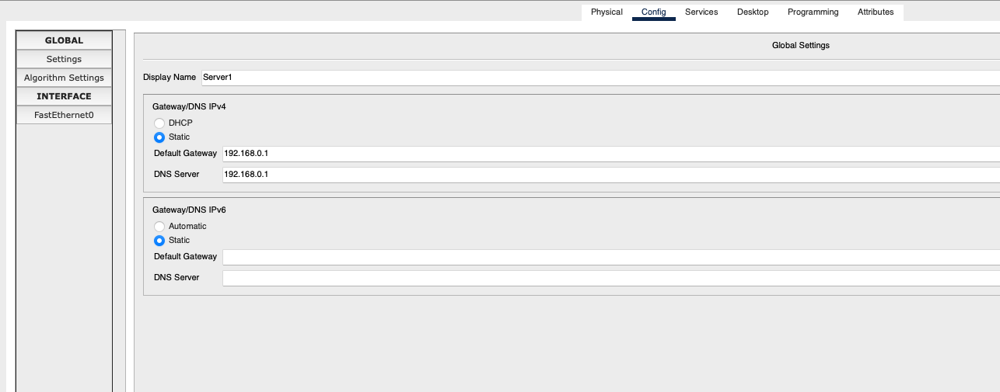

### FastEthernet0 Config

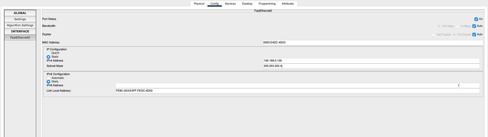

### Turn dns service

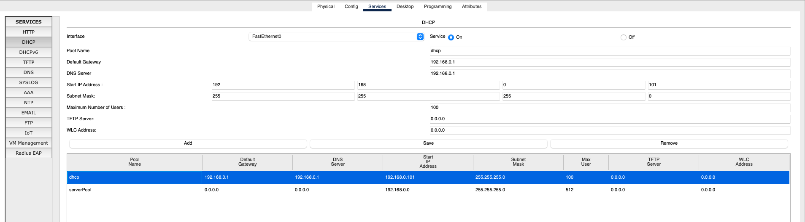

## PC Packet - ip renewal simulation (ipconfig /renew)

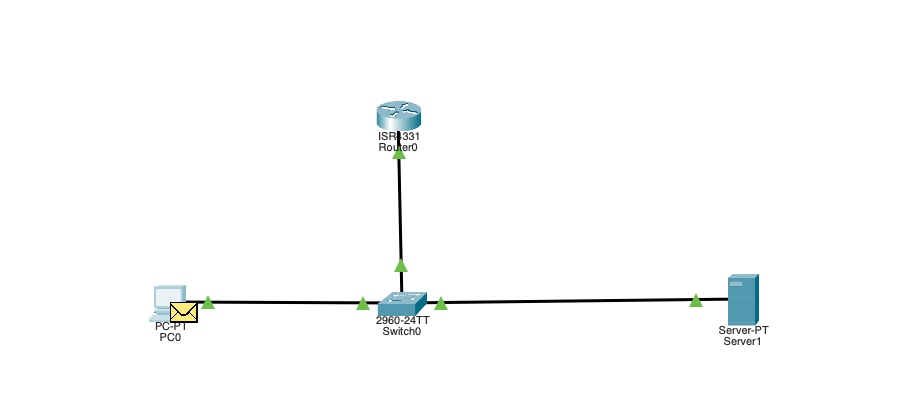

### Packet Details - OSI Model

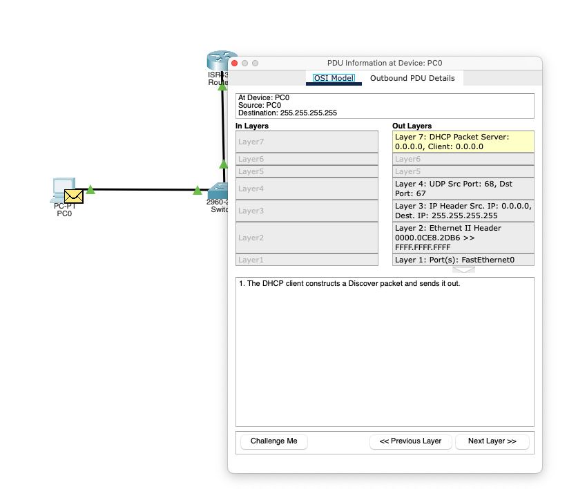

#### Packet Data Unit (PDU) - Outbound

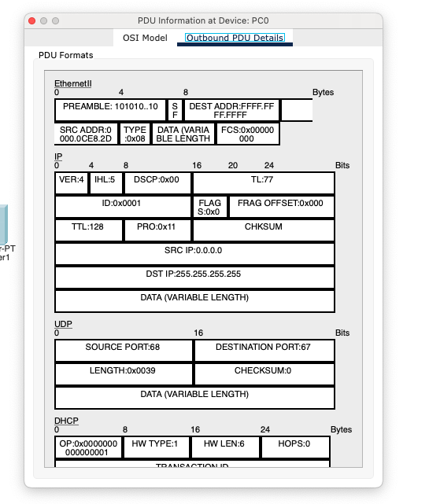

### Switch Packet PDU Info - OSI Model

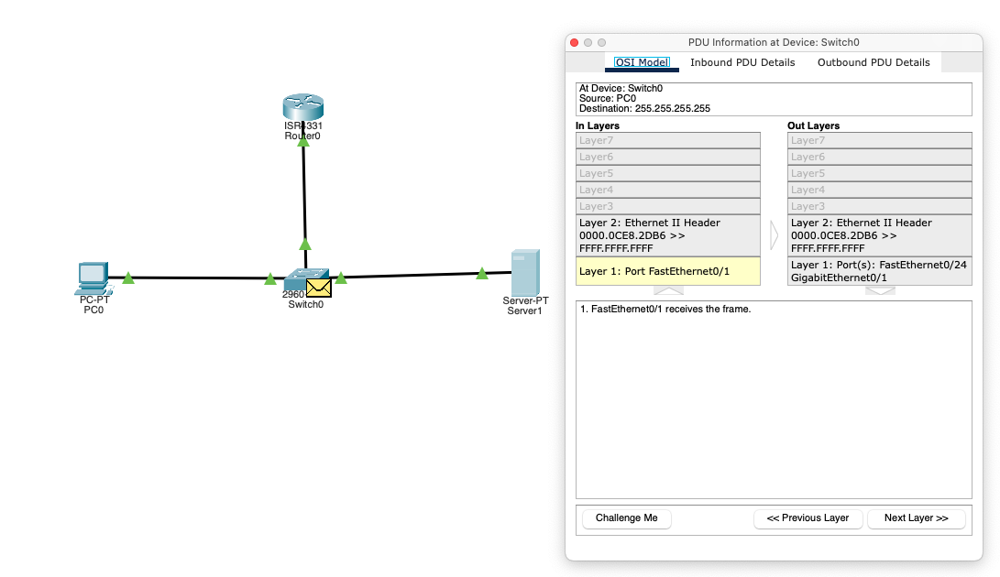

### Switch Packet PDU Info - Inbound

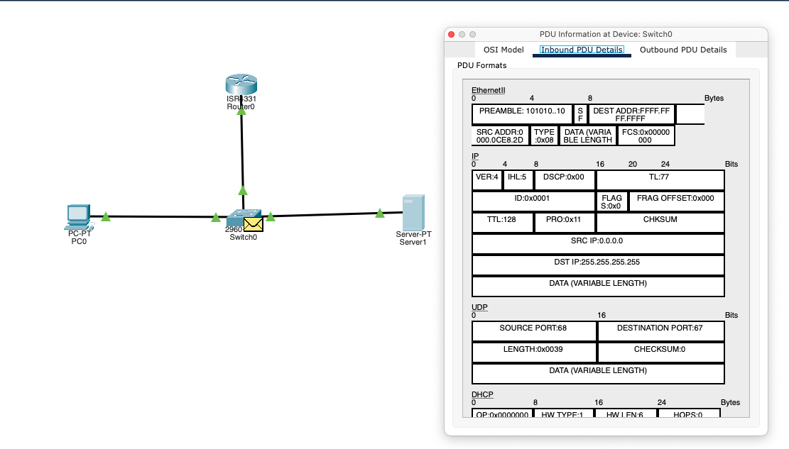

### Switch Packet PDU Info - Outbound

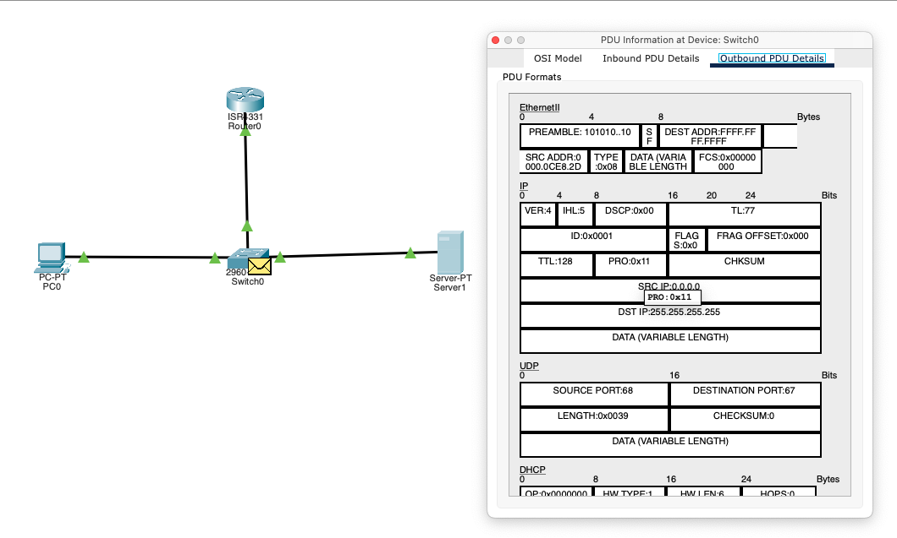

### Packet State - Router and Server 

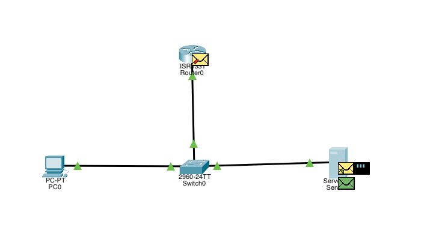

**Screenshot State:** The router has received an ICMP Echo Request and forwarded it out of its GigabitEthernet interface toward the server’s FastEthernet0 port. This view highlights how the router uses its routing table and ARP resolution to encapsulate and deliver the packet across the network segment.

**FastEthernet0 receives the frame**

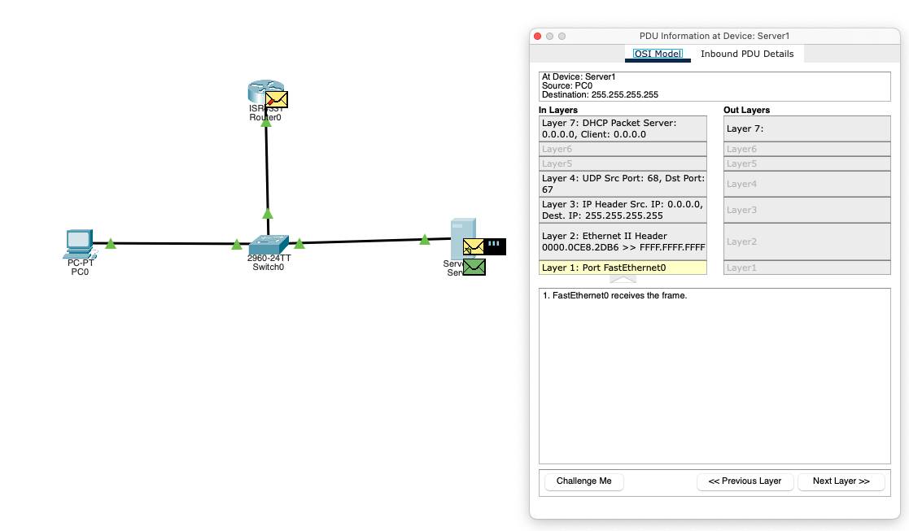

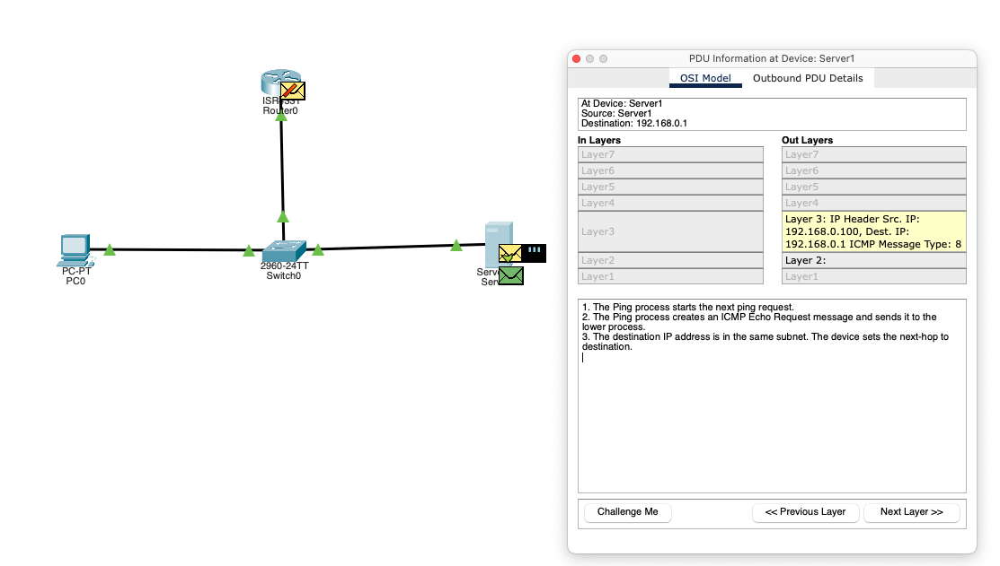

1. The Ping process starts the next ping request.
2. The Ping process creates an ICMP Echo Request message and sends it to the lower process.
3. The destination IP address is in the same subnet. The device sets the next-hop to destination.

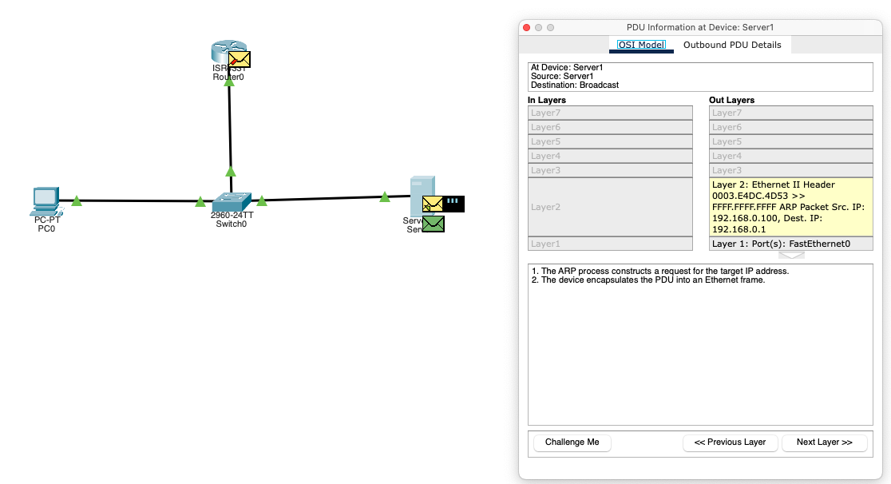

1. The ARP process constructs a request for the target IP address.
2. The device encapsulates the PDU into an Ethernet frame.

Router drops the packer

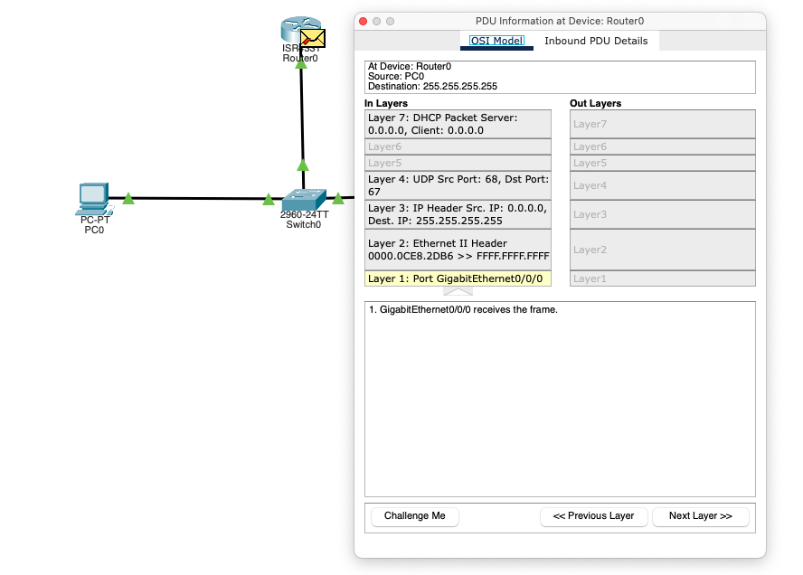

Packet sent back to the switch

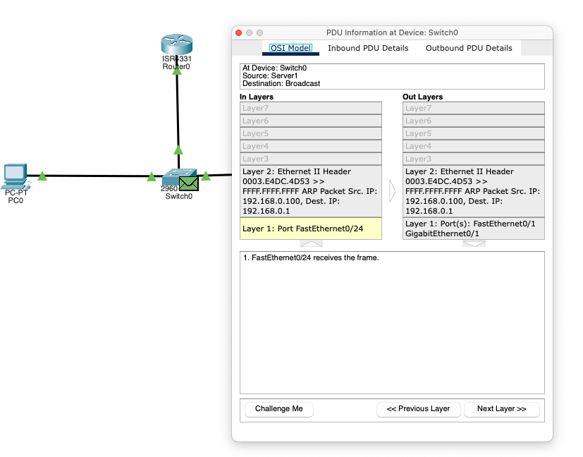

Packet back to PC with IP requested

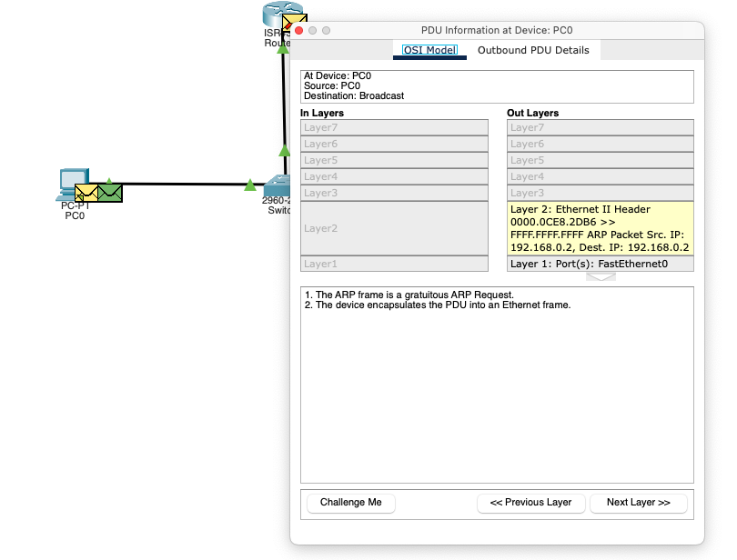

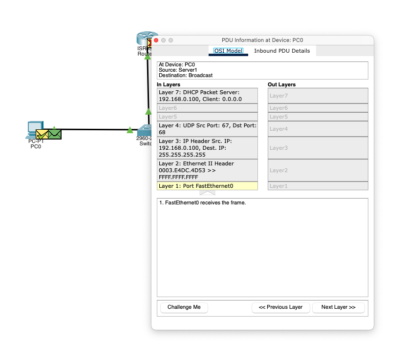
