# Windows Defender Firewall Rules

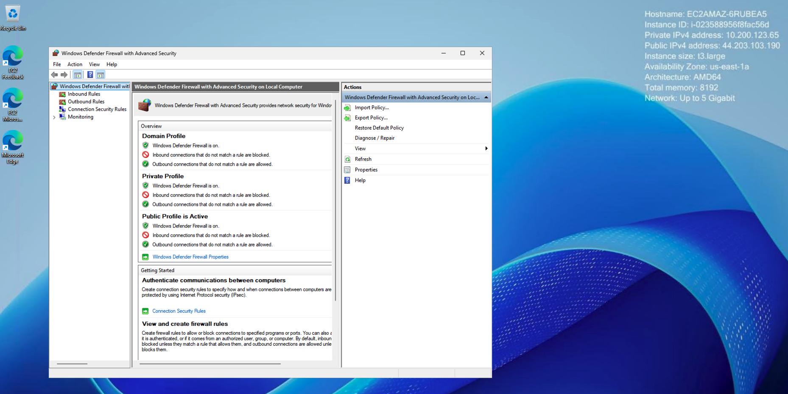

## Windows Defender Firewall Properties

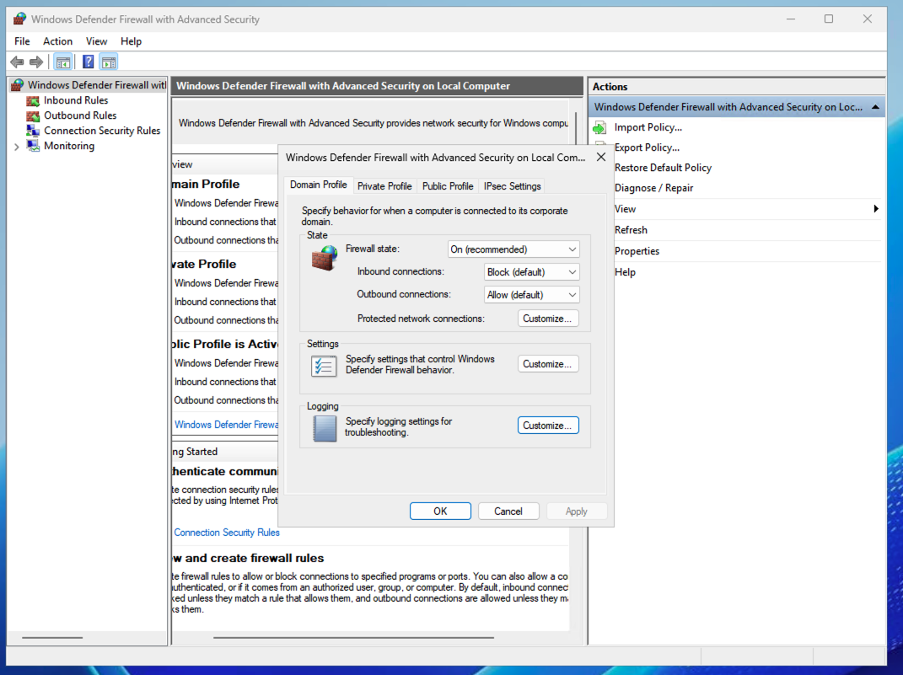


## Demonstrate Creating Windows Firewall Inbound rule to allow traffic connection from port `8000`

**Purpose**: Create a simple application that shows the windows EC2 details. First test it from the windows instance itself and later try testing the application from my laptop's browser

See application [here](./app/index.html) and application server [here](./app/app.py)


When you’re on a Windows EC2 instance the mechanics of IMDSv2 are the same, but you’ll use PowerShell (or curl for Windows) instead of `bash`. And because the metadata service doesn’t ship any CORS headers, you **cannot** fetch it directly from client-side JavaScript—you must proxy it through a little server-side component. Here’s how to get both pieces working:

---

### 1. Fetch the hostname from PowerShell

Open PowerShell on your Windows EC2 box (e.g. via RDP), then run:

```powershell
# 1) Grab an IMDSv2 token (valid for up to 6 hours)
$token = Invoke-RestMethod -Method PUT `
  -Uri 'http://169.254.169.254/latest/api/token' `
  -Headers @{ 'X-aws-ec2-metadata-token-ttl-seconds' = '21600' }

# 2) Use that token to fetch the hostname
$hostname = Invoke-RestMethod -Method GET `
  -Uri 'http://169.254.169.254/latest/meta-data/hostname' `
  -Headers @{ 'X-aws-ec2-metadata-token' = $token }

Write-Host "This instance’s hostname is: $hostname"
```

If you prefer `curl` (Windows 10+ includes it), the same two commands become:

```powershell
$token = curl -Method PUT `
  -Uri 'http://169.254.169.254/latest/api/token' `
  -Headers @{ 'X-aws-ec2-metadata-token-ttl-seconds' = '21600' } `
  -UseBasicParsing

curl -Method GET `
  -Uri 'http://169.254.169.254/latest/meta-data/hostname' `
  -Headers @{ 'X-aws-ec2-metadata-token' = $token } `
  -UseBasicParsing
```

---

### 2. Proxy‐ing the metadata into your `index.html`

Because the IMDS endpoint doesn’t allow cross-origin browser requests, you need a tiny server-side proxy. You could switch from `python -m http.server` to a minimal Flask app, for example:

1. **Install prerequisites**

   ```powershell
   python -m pip install flask requests
   ```

2. **Create a file `app.py` next to your `index.html`:**

   ```python
   from flask import Flask, jsonify, send_from_directory
   import requests

   app = Flask(__name__, static_folder='.')

   @app.route('/api/hostname')
   def hostname():
       # 1. Fetch IMDSv2 token
       token = requests.put(
           'http://169.254.169.254/latest/api/token',
           headers={'X-aws-ec2-metadata-token-ttl-seconds': '21600'}
       ).text
       # 2. Fetch metadata
       hostname = requests.get(
           'http://169.254.169.254/latest/meta-data/hostname',
           headers={'X-aws-ec2-metadata-token': token}
       ).text
       return jsonify(hostname=hostname)

   # Serve your existing index.html
   @app.route('/')
   def index():
       return send_from_directory('.', 'index.html')

   if __name__ == '__main__':
       # Listen on all interfaces so you can hit it remotely
       app.run(host='0.0.0.0', port=8000)
   ```

3. **Update your `index.html`** to hit the new endpoint:

   ```html
   <!DOCTYPE html>
   <html>
   <head><meta charset="utf-8"><title>Instance Hostname</title></head>
   <body>
     <h1>EC2 Hostname:</h1>
     <pre id="hostname">loading…</pre>
     <script>
       fetch('/api/hostname')
         .then(r => r.json())
         .then(data => {
           document.getElementById('hostname').textContent = data.hostname;
         })
         .catch(err => {
           document.getElementById('hostname').textContent =
             'Error fetching hostname: '+err;
         });
     </script>
   </body>
   </html>
   ```

4. **Run it**

   ```powershell
   python app.py
   ```

   Then point your browser (on the instance, or open port 8000 in the security group) at `http://<your-instance-IP>:8000/`.

---

### Alternative without Flask

If you’d rather stick to pure `http.server`, you can use its CGI mode and drop a small Python CGI script under a `cgi-bin/` folder. But in practice a handful of extra lines in Flask or even Node.js gives you the simplest path to proxy metadata into a static page.

---

With this in place, your page will show the EC2 hostname (or any other metadata path) without CORS errors, and you can still use PowerShell or `curl` directly from Windows whenever you like. Let me know if you need an example of the CGI approach or run into any bumps!


## Start Server

```sh
cd app
python app.py
```

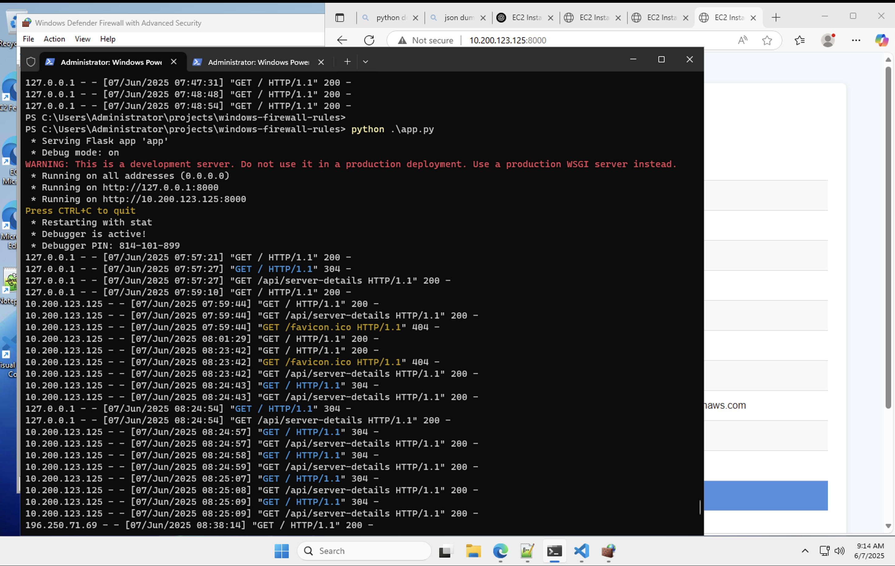

### Curl server

```sh
curl curl http://localhost:8000/
```

OR

```sh
 curl http://127.0.0.1:8000
```

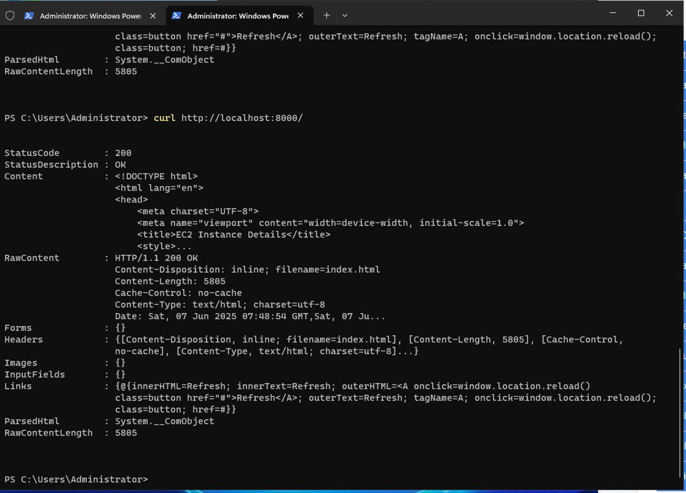

### Testing application internally ec2 instance with web browser

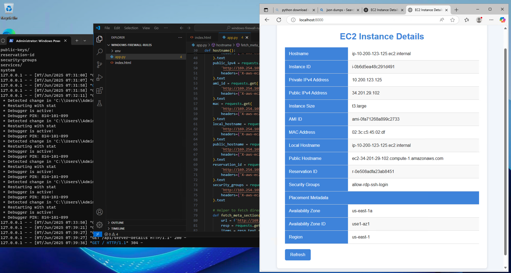

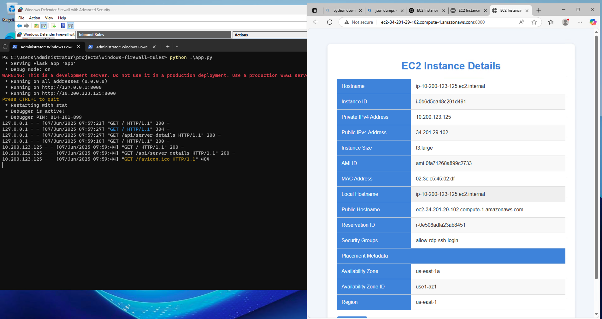

### Testing connecting on My Laptop outside AWS EC2 instance

On try to test on my web browser using my laptop outside AWS EC2 instance, I found that it was returning `server took long to respond`

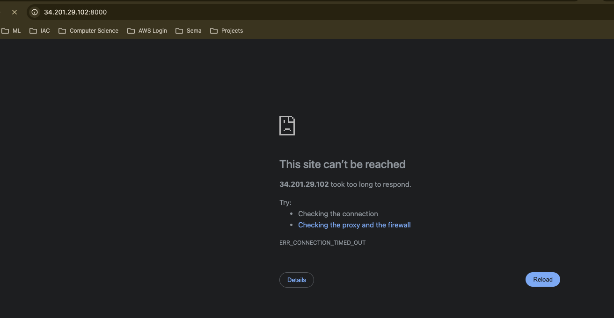

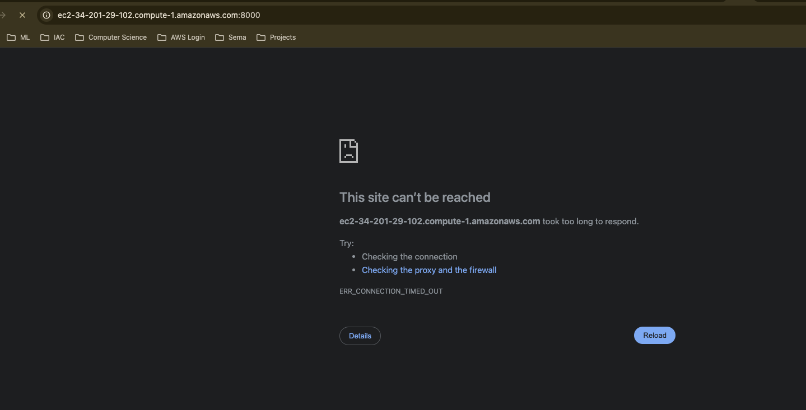

Then I had a chat with ChatGPT to find out why the issue? See chart below

#### Response from ChatGPT to help solve the issue
When you hit your instance’s **public** IP (or DNS) on port 8000 **from inside** the instance, two things conspire to make it time out:

---

##### 1. Your Security Group only lets *outside* traffic from 196.250.71.69/32

* You’ve locked down TCP 8000 to a single source: your home/work IP (196.250.71.69).
* **Inside** the instance, the source IP of your browser request is the instance’s *private* address (or the AWS NAT gateway), **not** 196.250.71.69, so the SG silently drops the packets.

##### 2. AWS doesn’t “hairpin” the public IP back to the instance

Even if your SG allowed it, connecting to **34.201.29.102** from *within* the VM generally won’t work—AWS’s Internet Gateway won’t loop back those packets to you.

---

##### ✅ How to fix

1. **Test locally**

   * In your RDP session open a PowerShell or CMD prompt and confirm your server is listening:

     ```powershell
     netstat -an | findstr ":8000"
     ```
   * Then browse to:

     ```
     http://localhost:8000/
     ```
   * Or, if you want to use the instance’s private IP:

     ```
     http://10.x.y.z:8000/
     ```

2. **Allow external access**

   * If you want to connect from *your* laptop or any machine *outside* AWS, add—or modify—an inbound SG rule on port 8000 so that the **Source** is either your current public IP or `0.0.0.0/0` (if you really want it world-accessible).
   * Don’t forget to save/apply the change.

3. **Check Windows Firewall**

   * By default Windows blocks new listening ports. In an elevated PowerShell session run:

     ```powershell
     New-NetFirewallRule `
       -DisplayName "Allow TCP 8000" `
       -Direction Inbound `
       -Protocol TCP `
       -LocalPort 8000 `
       -Action Allow
     ```

4. **(If you ever switch to Flask)**

   * Remember to bind to all interfaces:

     ```python
     app.run(host="0.0.0.0", port=8000)
     ```
   * Otherwise Flask will only listen on 127.0.0.1.

---

Once your SG and Windows-firewall both allow port 8000, and you point your browser at the *correct* interface (localhost or private IP from inside; public IP from outside), you’ll see your page instead of a timeout.


So we see that chatgpt was suggesting about updating security group rules

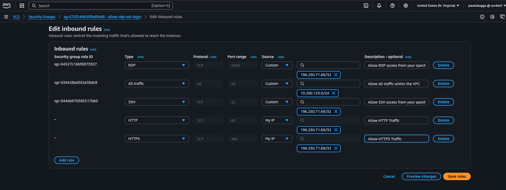
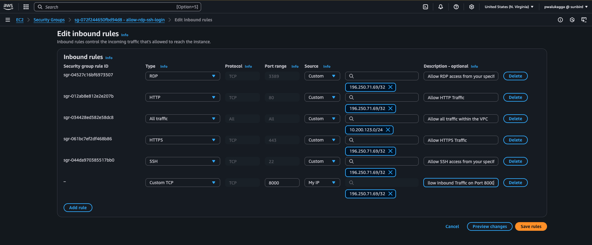

On updationg the rules, still the inbound traffic coming from port `8000` was still not allowed.

But we see that on point **3** ChatGPT says `By default Windows blocks new listening ports.`. So I needed to create an `Inbound Firewall Rule` to allow connection on Port `8000`.

Here I used the terminal as suggested by ChatGPT though I could the same using the GUI

I created an `Inbound Firewall Rule` called `Allow TCP 8000`

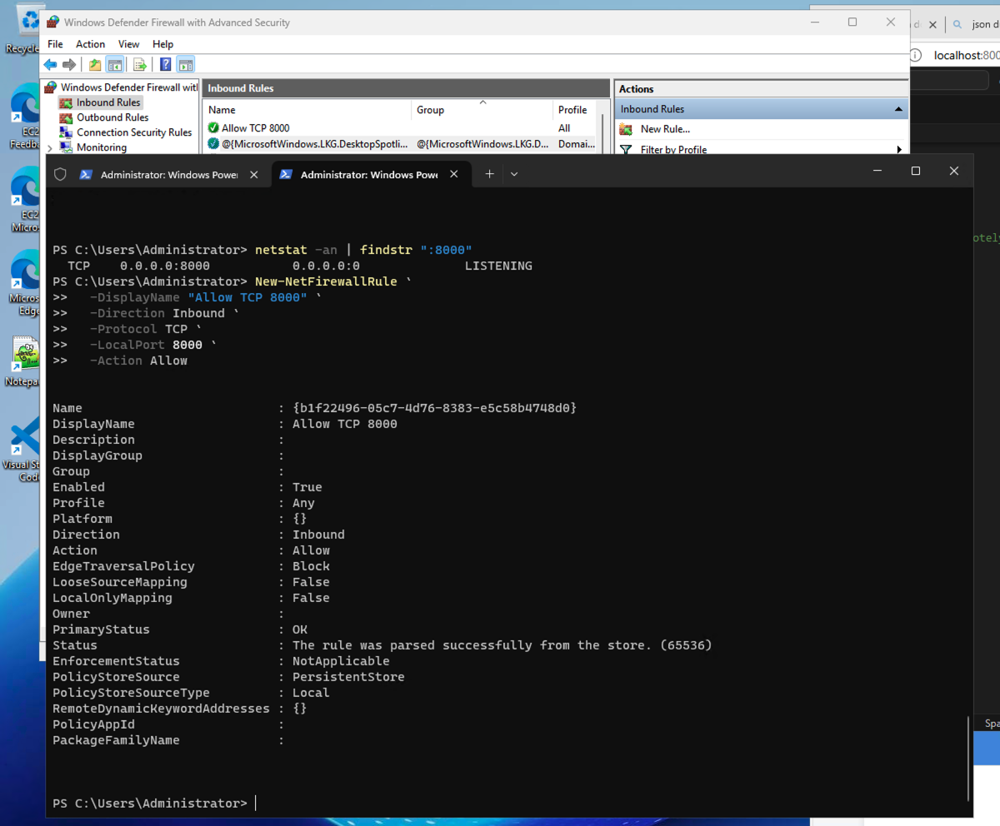


And now I see the connection from my laptop using port `8000` was successful.

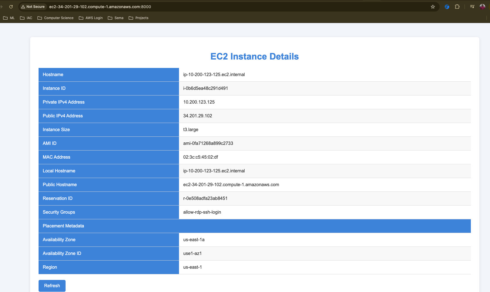


On disabling the firewall rule, I see that the connection started failing again.

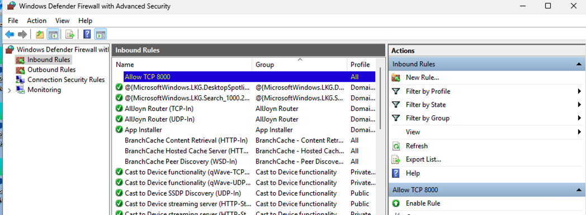


> **Note**: By default Windows blocks new listening ports. You need to create `Inbound Firewall Rules` to allow connections on these ports.