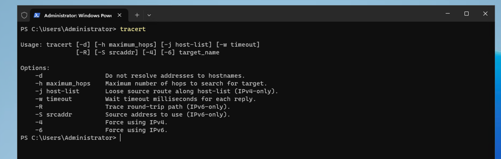

# Windows Networking Tools

## Windows EC2 Cloud Environment (ipconfig)


#### Interpreting `ipconfig /all` on AWS Windows EC2

- **Adapter**: The primary Elastic Network Adapter on the EC2 instance, typically labeled "Ethernet" or "Ethernet 2" in Windows.  
- **Description & Physical Address**: Shows the AWS-assigned ENA interface name and its MAC (e.g., `02-42-0A-...`), which maps to the EC2 network interface (ENI).  
- **DHCP Enabled**: `Yes` – AWS VPC uses a DHCP service to assign IPv4 addresses and other network parameters.  
- **IPv4 Address**: Private IP from the VPC subnet CIDR (e.g., `10.0.1.23`), automatically leased at instance launch.  
- **Subnet Mask**: Matches the VPC subnet mask (e.g., `255.255.255.0`).  
- **Default Gateway**: The VPC router (e.g., `10.0.1.1`) used for routing traffic to other subnets or the Internet via the Internet Gateway.  
- **DHCP Server**: AWS-provided DHCP at the VPC level (commonly the base address plus `.2`), managing leases and DNS settings.  
- **DNS Servers**: Points to the AmazonProvidedDNS (often `.2` in each subnet) or custom DNS if defined in the VPC options.  
- **Lease Obtained / Expires**: Times when AWS DHCP granted and will renew the lease; typically 7–14 days by default.  
- **NetBIOS over Tcpip**: `Enabled` indicating Windows name resolution support, though DNS is primary in cloud deployments.  

This output confirms the EC2 instance’s network settings were correctly provisioned by AWS DHCP, placing it in the designated VPC subnet with connectivity to the gateway and configured DNS services.

## ipconfig


#### Understanding `ipconfig`

- **Command**: `ipconfig` is a Windows CLI tool that displays the IPv4 and IPv6 address assignments, subnet masks, and default gateways for all network adapters.
- **IPv4 Address**: The primary IP address assigned to the adapter (e.g., `192.168.0.10`).
- **Subnet Mask**: Defines the network portion versus host portion (e.g., `255.255.255.0`).
- **Default Gateway**: The router address used for traffic outside the local subnet.

## ipconfig /?


#### Understanding `ipconfig /?`

- **Command**: `ipconfig /?` displays the help output for `ipconfig`, listing all available switches and syntax.
- **Usage Information**: Shows options such as `/all`, `/release`, `/renew`, `/flushdns`, and other parameters supported by `ipconfig`.

## ipconfig /all


#### Understanding `ipconfig /all`

- **Detailed View**: Provides a comprehensive report of each adapter’s full TCP/IP configuration.
- **Host Name & DNS Suffix**: The Windows computer name and DNS domain suffix used for name resolution.
- **Physical Address (MAC)**: The hardware address of the network adapter.
- **DHCP Enabled & DHCP Server**: Indicates whether DHCP is used and the DHCP server’s IP address.
- **Lease Obtained / Lease Expires**: Displays DHCP lease start and expiration times.
- **DNS Servers**: Lists all DNS resolver addresses configured on the adapter.
- **NetBIOS over Tcpip**: Shows if NetBIOS name resolution is enabled on the adapter.

Use these `ipconfig` variations to diagnose network connectivity, DHCP issues, and name resolution problems on Windows machines.

## ping

### ping /?


#### Understanding `ping /?`

- **Command**: `ping /?` displays the help information for the Windows `ping` utility.
- **Usage Information**: Lists all available switches and syntax, such as `/t`, `/a`, `/n`, `/l`, `/f`, and more.

### ping -t www.google.com


#### Understanding `ping -t`

- **Continuous Ping**: The `/t` flag sends ICMP Echo Requests to the target indefinitely until manually stopped (Ctrl+C).
- **Use Case**: Useful for long-term connectivity monitoring or checking packet loss over time.
- **Output**: Shows a running count of replies, round-trip times, and indicates when the command is interrupted.

### ping -a www.google.com


#### Understanding `ping -a`

- **Name Resolution**: The `/a` switch resolves the target IP address to its hostname.
- **Use Case**: Helps verify reverse DNS lookup and confirm the identity of the remote host.
- **Output**: Displays the hostname of the target before each reply line.

### ping -n count (ping -n 20 www.google.com)


#### Understanding `ping -n`

- **Request Count**: The `/n <count>` parameter specifies the number of ICMP Echo Requests to send.
- **Example**: `ping -n 20 www.google.com` sends exactly 20 pings and then stops automatically.
- **Use Case**: Good for scripted tests, quick health checks, or benchmarking specific packet counts.

## tracert




#### Understanding `tracert`

- **Command**: `tracert <target>` sends ICMP Echo Requests with incrementing Time-To-Live (TTL) values to discover each hop along the path.
- **Mechanism**: Routers decrement the TTL; when it reaches zero, they return a TTL-expired message, revealing their IP/hostname.
- **Output**: Lists each hop’s address (IP or resolved name) and round-trip times for up to three probes per hop.
- **Use Cases**:
  - Map the route taken by packets to a destination.
  - Identify where in the network path connectivity breaks or encounters high latency.
  - Compare performance across different network segments.
- **Common Options**:
  - `/d` : Skip DNS lookup to speed up results by showing raw IPs.
  - `/h <maxHops>`: Specify maximum hops to trace (default is 30).
  - `/w <timeout>`: Set timeout in milliseconds for each reply.

## nslookup


#### Understanding `nslookup`

- **Command**: `nslookup [<name> [<server>]]` queries DNS to resolve hostnames to IP addresses (and vice versa).
- **Non-Interactive Mode**: Run `nslookup example.com` to perform a single lookup using the default DNS server.
- **Specify Server**: `nslookup example.com 8.8.8.8` queries Google’s DNS directly, bypassing the system default.
- **Interactive Mode**: Launch `nslookup` with no arguments to enter a prompt (`>`):
  - `> server 1.1.1.1` – change query server.
  - `> set type=MX` – switch record type to MX.
  - `> example.com` – run the lookup with current settings.
  - `> exit` – leave interactive mode.
- **Record Types**: Query A, AAAA, MX, NS, TXT, SOA, etc., by using `set type=<TYPE>`.
- **Use Cases**:
  - Diagnose DNS resolution issues and propagation delays.
  - Verify specific record data (mail exchangers, name servers, SPF/TXT records).
  - Compare responses from different DNS servers for troubleshooting or performance testing.

## netstat


#### Understanding `netstat`

- **Command**: `netstat` is a Windows command-line utility that displays active TCP and UDP connections, listening ports, routing tables, and network interface statistics.
- **Common Options**:
  - `-a` : Show all active connections and listening ports.
  - `-n` : Display addresses and ports in numeric form (skip DNS resolution).
  - `-o` : Include the Process ID (PID) associated with each connection.
  - `-p <protocol>` : Show connections for the specified protocol (TCP or UDP).
  - `-r` : Display the IP routing table.
  - `-s` : Show per-protocol statistics (e.g., packets sent/received, errors).

- **Output Fields**:
  - **Proto**: Protocol (TCP or UDP).
  - **Local Address**: The IP and port on the local machine.
  - **Foreign Address**: The remote endpoint IP and port.
  - **State**: Connection state (e.g., LISTENING, ESTABLISHED, TIME_WAIT).
  - **PID**: Process ID owning the socket (shown with `-o`).

- **Use Cases**:
  - Identify which ports are open and listening for incoming connections.
  - Troubleshoot port conflicts or verify that a service is bound to the correct port.
  - Map active network connections and their associated processes.
  - Inspect the local routing table to verify network pathways.
  - Gather protocol statistics to analyze network performance or errors.

**Example**:
```powershell
netstat -ano | findstr LISTENING
```
List all listening ports along with PIDs to pinpoint services awaiting connections.

## route


#### Understanding `route`

- **Command**: `route` displays and modifies the host's IP routing table on Windows.
- **Common Usage**:
  - `route print` : shows IPv4 and IPv6 routing tables, including destination networks, masks, gateways, metrics, and interface indexes.
  - `route add <destination> mask <mask> <gateway> [metric <n>] [IF <if_index>]` : adds a new route to the specified network.
  - `route delete <destination>` : removes the specified route from the table.
  - `route change <destination> mask <mask> <gateway> [metric <n>] [IF <if_index>]` : modifies an existing route’s parameters.
- **Output Fields**:
  - **Network Destination**: target subnet or host (e.g., `192.168.10.0`).
  - **Netmask**: subnet mask defining the network portion.
  - **Gateway**: next-hop router IP for that route.
  - **Interface**: local interface index used to reach the gateway.
  - **Metric**: route priority; lower metrics are preferred.

#### Persistent Routes

- **Definition**: Persistent routes are static routes that remain in the routing table across system reboots.
- **Adding a Persistent Route**:
  - Use the `-p` flag with `route add`:  
    ```powershell
    route -p add 10.200.200.0 mask 255.255.255.0 192.168.1.1 metric 5
    ```  
  - The `-p` option writes the route into the system registry so it loads on startup.
- **Viewing Persistent Routes**:  
  - Run `route print -p` to filter or inspect persistent entries.
- **Use Cases**:
  - Ensure critical network paths (e.g., site-to-site links, management networks) survive reboots.
  - Override default gateways for specific subnets.
  - Support redundant or backup routes without relying on dynamic routing protocols.
